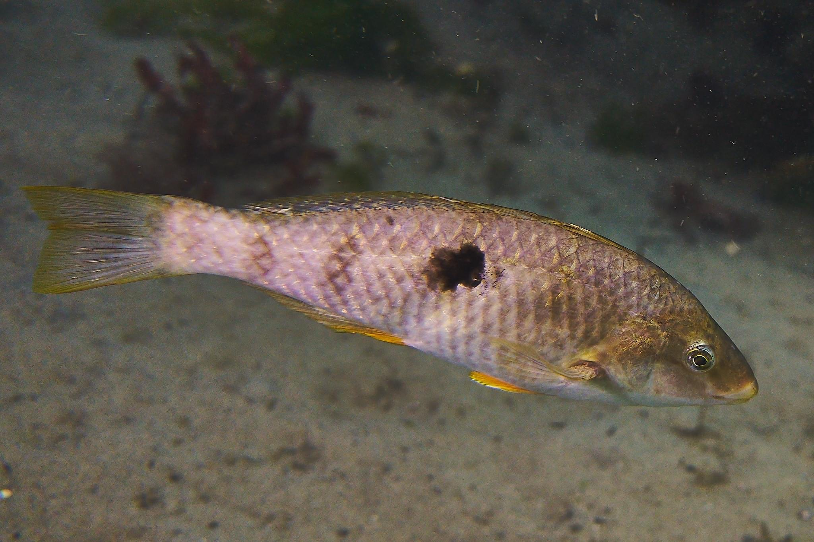

# The RNA-seq workflow

::: {.callout-note}
# Key points 🗝️  

- What are the key steps in an RNA-seq data analysis workflow?   
- What are the peculiar features of RNA-seq data, and how do we address these features to make sure our analysis is unbiased and accurate?   
- What methods are available to handle RNA-seq data analysis?  
:::

## The RNA-seq workflow overview

We will assume that the aim of our RNA-seq experiment is to identify a set of genes which are differentially expressed between two or more groups, and to derive biologically meaningful information from our gene list(s). 

Assuming this is the case, there are many methods that can be applied to this type of analysis and this can be overwhelming. Here we will look at what we call the core workflow - the major steps that you will take to go from the raw FASTA files (the output from an RNA-seq experiment) to an informative list of differentially expressed genes. 

### Core steps in a common workflow:
1. Quality assessment of the raw data
2. Adapter removal and cleanup
3. Quantification of gene expression
4. Identifying differentially expressed genes
5. Over-representation analysis

As you will see, for some steps there are multiple tools that take a functionally similar approach (*e.g.,* quality assessment and adapter removal). For other steps, especially for quantification and identification of differentially expressed genes, there are different methodologies available. These methodologies take different routes to address complex biological, computational and statistical questions. A key takeaway from this workshop is that it is not always possible to identify a "best" tool - *you must be willing and able to identify the strengths and weaknesses of available tools and decide, based on your question and experiment, which tool is most appropriate for you*. 

Let's look at some peculiar features of RNA-seq data and identify the challenges these raise for us as data analysts. 

## What are the main challenges or decision points?

Knowing what cut offs to use or whether outputs are good enough is a constant question you'll ask yourself. It's not always possible to know for sure the correct answer (for example, whether you have enough biological replicates to meaningfuly detect differential gene expression).  Because gene expression is so dynamic, what's normal for your particular tissue at a particular time under a given treatment is often hard or even impossible to determine. In biology we often aim for a minimum of n=3 replicates, in RNA-seq we recommend a minimum of n=5 biological replicates.   

### Counting or quantifying

This is not an exhaustive overview of RNA-seq data, but as a reminder, the raw data we receive in the form of FASTA files is a series of reads from *somewhere* in the genome. Each read is an indication, or measurement, of gene expression. We must take these reads, identify where in the genome they originated from and then make a measurement of how frequently we observed those reads. The more reads that are mapped back to a specific location in the genome, the more highly expressed that region (gene) is. 

There are two major approaches to measure gene expression from reads: in the first method reads are aligned to a reference genome and are then 'counted' (*e.g.,* using programs such as [featureCounts](https://subread.sourceforge.net/featureCounts.html) or [HTSeq](https://htseq.readthedocs.io/en/latest/htseqcount.html)), while in the second method reads are 'quantified' without the need to align to a reference (these are sometimes referred to as 'pseudocounts' or 'pseudoalignment'; example programs include [Salmon](https://combine-lab.github.io/salmon/) and [Kallisto](https://pachterlab.github.io/kallisto/about)). There are arguments for each of these types; one major point of difference is if you are after gene-level resolution (count method) or transcript-level resolution (quantify method), but a full discussion of these and other approaches is beyond the scope of this workshop. 

### Library sizes and composition

Due to myriad biological and technical effects, each sample will have differing numbers of total reads (different library sizes). When we attempt to compare gene expression across samples, these different library sizes can cause genes to be over- or under-expressed. Before we can compare samples we must correct for library size differences. 

Additionally, we need to be aware of library composition. If a library has one (or a few) genes that are very highly expressed, they can be thought of as 'taking up' a high proportion of the total library of reads. If we compare this skewed library with another library, some genes may look down-regulated in the skewed library. Here is a great resource on [different ways to normalise counts](https://hbctraining.github.io/Intro-to-DGE/lessons/02_DGE_count_normalization.html), which can account for  library size and/or composition, produced by the [Harvard Chan Bioinformatics Core.](https://github.com/hbctraining/Intro-to-DGE). 

### Heteroscedasticity

[Heteroscedasticity](https://en.wikipedia.org/wiki/Homoscedasticity_and_heteroscedasticity) describes a situation where variance changes with the mean, as opposed to homoscedasticity, where variance does not change with the mean. In RNA-seq data the level of variance associated with each gene is dependent on the mean expression level of the gene (*i.e,.* RNAseq data is heteroscedastic). This is an issue since some statistical approaches (specifically, the Poisson distribution) assume homoscedasticity (that is, that variance is not associated with the mean). 

Two approaches to dealing with heteroscedasticity are common in the literature: transform the data to reduce (or remove) the mean-variance association or use a method that is robust to the mean-variance association ([DESeq2](https://doi.org/10.1186/s13059-014-0550-8) with the Negative Binomial distribution). 

This [write-up](https://github.com/friedue/Notes/blob/master/RNA_heteroskedasticity.md) gives an in-depth explanation of heteroscedasticity and how we can think about it.

#### **Discussion** 🤔 

Do you expect genes with higher mean expression to have higher or lower variance than genes with low expression? That is, which will have *higher variance* - genes with high average expression or genes with low average expression?

::: {.callout-note collapse="true"}
## Solution
This can be a surprisingly complex question to answer, and depends on how we think about variance. If a gene has a high mean expression (*e.g.,* say 1000), then we can expect that the standard deviation will be a reasonably high number (*e.g.,* let's say 20). If a gene has low mean expression (e.g., 10), then the standard deviation will be small (*e.g.,* 2). So, it is true to say that for genes with higher average expression, the standard deviation is greater.

However, we also need to think about magnitude of variance, which we can do using the numbers from our above imaginary examples. For the gene with a mean expression of 1000 and sd of 20, going from 1000 to 1020 is not a big change (*i.e.,* 1.02 fold change). For the gene with the low mean expression, going from 10 to 12 *is* a large change (*i.e.,* 1.2 fold change).

Our assumption then is that a large fold change, regardless of the actual read count change for that gene, has a meaningful biological effect. 

We will look more at heteroscedasticity when we begin to identify differentially expressed genes, but for now it is important to be aware of the concept.

:::

### Gene length

Does gene length matter? Yes it does! Sort of. The longer a gene is, the more likely it will have reads mapped to it. This is important to be aware of, but when we are identifying differentially expressed genes we are always comparing genes to themselves. Therefore, gene length is not a factor when identifying differentially expressed genes. However, gene length does need to be taken into account when we carry out over-representation analysis.

## Introduction to the dataset

The example datasets in this workshop come from a New Zealand wrasse species (*Notolabrus celidotus*), known as "spotty" or "paketi" in Te Reo Māori. Spotty is endemic to New Zealand and is found abundantly along the entire coastline. They are protogynous sequential hermaphrodites, meaning individuals can change sex from female to male. During adult sex change, the gonads transition from a functional female phenotype with mature ovarian tissue, through a series of early-, mid- and late-transitional stages, to a functional male phenotype with sperm-producing gonad tissue. This change is also accompanied by physiological, neurological and morphological changes in the fish. 

The workshop data comprise of 15 gonad transcriptomes from three of these phenotypes – adult female ("F"), mid-transitional ("MT") and terminal phase male ("TPM"). The raw RNA-seq reads are available on the NCBI SRA under [BioProject PRJNA631152](https://www.ncbi.nlm.nih.gov/bioproject/631152).
 
 \

<table style="border: none; border-collapse: collapse;">
  <tr style="border: none;">
    <td style="border: none; padding: 0;">
      
    </td>
    <td style="border: none; padding-left:20px; text-align: justify;">
      <i>Figure 1. A female spotty wrasse in Dunedin Harbour</i> 
       
    </td>
  </tr>
</table>

