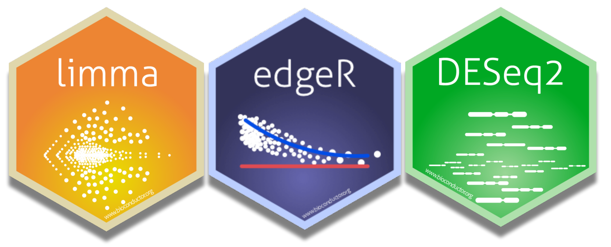
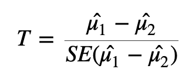

# Identify Differentially Expressed Genes



Are those two groups *significantly different* from one another is a challenging question to answer. We can start by specifically asking our question as a statistical question: Are the differences we *observe* between the two groups **greater than the differences** we would *expect* to see by chance?

## T-tests and p-values

The statistical approach to this question is to begin with the null hypothesis (that there is no difference between the two groups) and test whether or not you can reject the null.

To test whether or not we can reject the null hypothesis we can calculate a test statistic:



Here we are taking the difference between the means of the two groups and then dividing that difference by some measure of variability - in this case, dividing by the standard error.

If the difference in means is **LARGE** relative to the variance, the test statistic will be large (indicating significance). If the difference between the means is **small** relative to the variance, the test statistic will be small, indicating the difference is probably not significant (*i.e.,* the difference we observe is in-line with the variance we observe).

#### **Exercise:** With the above formula in mind, what impact would heteroscedasticity have when you are attempting to identify differentially expressed genes?

Once we have a test statistic we will calculate a p-value. The p-value is an indication of how likely we were to observe the given difference in means (or a more extreme difference) *if there is truly no difference between the means*. That is, how likely are we to see this difference due to random chance?

### Interpreting p-values

How do we interpret the p-value? We will specify a threshold (usually 0.05), and say that if a p-value is less than this threshold we will consider it a significant result. If the p-value is lower than the threshold we set, we will reject the null hypothesis (that the groups are identical) and accept the alternative (that there is a difference between the groups). The threshold we set is our level of "risk" that this event happened by chance alone.

When we declare that a result with a p-value of less than 0.05 is significant, we are saying that *we believe the difference to be true* since, if there was truly **no** difference, **such a result would happen less than 5% of the time**.

A useful mental analogy is to consider flipping a coin. We know that for a fair coin, the odds of getting heads is 50:50. Still, if we get four heads in a row it doesn't worry us - it's entirely plausible given the variation we expect. But if we get 50 heads in a row, while we know it's statistically *possible*, we know it's very unlikely to see such an extreme result. If we got to 100 heads in a row, we might instead start to question the fairness of the coin - we would reject the null hypothesis that the odds of heads and tails is identical.

### Types of errors

It's important to think about the two possible ways in which we could be wrong when testing a hypothesis like this: we could generate a false positive or a false negative.

-   A false positive or Type I error is when we *reject* the null hypothesis when there is **truly no significant difference**.

-   A false negative or Type II error is when we *fail to reject* the null hypothesis when there **truly is a significant difference**.

When we select a p-value threshold of 0.05, we are accepting the fact that 5% of the time that the null hypothesis is true, we will reject it. This becomes hugely problematic when you are testing thousands of genes! In order to avoid a large number of false positives we must correct for multiple testing. The more tests we are doing, the more stringent we need to be. We will not cover multiple testing corrections in depth but will briefly mention two types:

-   Family-wise Error Rate (FWER), also called the Bonferroni and Holm corrections, is a highly stringent procedure. This approach will give the minimal possible number of false positives, but will miss some true positives. Good if false positives are particularly costly (*e.g.,* if you are providing someone with a severe medical diagnosis).

-   False Discovery Rate control (FDR), also called the Benjamini and Hochberg correction, is less conservative than FWER. This approach will identify more significant events, but expect a greater number of false positives. Use this approach if you are more concerned about missing something valuable and can afford a few false positives.

#### **Exercise:** Note down some key features of your experiment. Are you more inclined to use FWER or FDR? Which is more appropriate for your data and your experimental situation?

### Modifying the t-test for RNA-seq

Many biological experiments struggle with getting enough samples for statistical significance. In RNA-seq experiments it is common to see groups of three samples or replicates. This is especially problematic when using the t-test (or similar procedures that involve variance). When testing for differences in gene expression it is possible to encounter genes with a small difference in the mean between the two groups and, due to the small sample size, a *very* small level of variation (a small standard error). A small difference in the means divided by a *very small* standard error translates to a large test statistic, which is then translated to a small p-value and what **looks** like a highly significant result.

Since this issue is caused by an artificially low standard error due to low sample numbers, a number of methods have proposed artificially increasing the standard error in some way. One way to implement this is through Shrinkage Estimation, which involves using Empirical Bayes methods to adjust individual test statistics based on the overall distribution of variances. During shrinkage estimation, small standard errors are made larger while large standard errors are made smaller.

## Identifying differentially expressed genes using LIMMA

Limma involves data transformation and log scales to account for the data being in a non-normal distribution.

Limma will create one of the special objects mentioned earlier in this workshop to store data. For Limma, this will be called a Digital Gene Expression object (DGE object). We will use the edgeR package to create this DGE object using three functions from the `edgeR` package -- `DGEList()`, `calcNormFactors()` and `cpm()`.

Load the libraries required for running limma, create a dge object where we specify counts (here you specify the matrix that contains your counts, in our case our object is already called counts). Then calculate normalisation factors, which will be used to adjust for library size differences, and calculate the log CPM. logCPM is, for each gene, how many counts there were per million reads. Because we are taking the log of this value, we will use the prior.counts=3 argument to add 3 to all read counts. This prevents any errors due to attempting to take the log of 0.

```{r}
#| message: false
# BiocManager::install("limma")
# BiocManager::install("edgeR")
# BiocManager::install("DESeq2")

library(limma)
library(edgeR)
library(dplyr)
load("counts.RData")
```

`DGEList()` creates a Digital Gene Expression object from your count matrix. This is edgeR's core data structure and stores your counts along with sample and gene information.
```{r}
dge <- DGEList(counts=counts)
```

`calcNormFactors()` calculates TMM (Trimmed Mean of M-values) normalisation factors for each sample. These account for differences in library size and composition between samples, ensuring counts are comparable across samples. TMM is the default method used in calcNormFactors() and you can specify different methods (try `?calcNormFactors()`), but TMM is good for pairwise comparisons between two groups of samples (most RNAseq experiments). See here a general guide on understanding [count normalisation from HBC training](https://hbctraining.github.io/Intro-to-DGE/lessons/02_DGE_count_normalization.html). 


```{r}
dge <- calcNormFactors(dge)
```

Here we take a peek at the transformed counts using `cpm()`. This converts raw counts to log counts per million (log-CPM). The `prior.count=3` argument adds 3 to all counts before log transformation — this prevents errors from taking the log of zero, and also reduces the influence of very lowly expressed genes. Soon we will use the `voom()` function to address heteroscedasticity -- but we will use our `dge`{style="color:black"} object, as voom will perform its own log-CPM transformation internally, and additionally estimate precision weights for each gene (to account for heteroscedasticity). 

```{r}
logCPM <- cpm(dge, log=TRUE, prior.count=3)

head(logCPM, 3)
```

### The design matrix

We use the design matrix to specify our different groups. Initially we will just look at a simple design, where we will specify wt and mutant. However, you can also include other information *e.g.,* if your two sample groups were comprised of male and females and you had reason to suspect there might be sex-dependent factors involved.

```{r}
conds <- c("WT","WT","WT","MT","MT","MT")

design <- model.matrix(~conds)

design
```

If you have your metadata in a dataframe (see note in DESeq2 section on coldata files and design matrix), you can alternatively specify your design as such: `design <- model.matrix(~conds, data = metadata_df)`.  


### Addressing heteroscedasticity with Limma

Limma has a function called voom which we can use to address heteroscedasticity (a case where mean and variance are not independent). Voom will estimate the strength of the relationship between mean and variance and calculate "precision weights" for each gene. These are then used to normalise the data during the identification of differentially expressed genes.

Create an object, `v`{style="color:black"}, by calling the voom function on the Digital Gene Expression (dge) object. The v object will be used in later analyses. We will add information about our experimental setup by specifying the design object, and we will also call `plot = TRUE` to generate a plot showing the heteroscedasticity.

```{r}
v <- voom(dge, design, plot = TRUE)
```

This plot highlights an earlier point about heteroscedasticity. For genes with low expression, the variance (here the square root of the standard deviation) is highly variable. Because the variance is dependent on the mean, we describe this data as heteroscedastic. Our v (voom) object contains information relating to the curve line (red) and makes an adjustment factor, so that the data will have a uniform relationship between the mean and variance.

Importantly, other than changing the mean-variance relationship, voom does not cause significant changes to the underlying data.

#### The impacts of voom

```{r}
boxplot(v$E ~ col(v$E), ylab = "Counts", xlab = "Samples", main = "Log counts after voom")
```

We can see that log counts in the voom object (that is, counts after voom has been applied to create a stable mean-variance relationship) have not drastically changed from when we plotted them earlier.

We can also visualise the data in the form of density plots:

```{r}
lineColour <- ifelse(conds=="MT", "red", "blue")
lineColour

plot(density(v$E[,1]), ylim=c(0,0.3), col=lineColour[1])
for(i in 2:ncol(v$E)) lines(density(v$E[,i]), col=lineColour[i])
```

We can see that voom has not removed the differences between our sample groups.

What if we wanted to remove these differences? Remember, we (probably) cannot be certain as to whether these differences are biological or technical. In cases like this it can be good to run your analysis multiple ways - first without removing the differences, and then after removing the differences. If a decision like this causes your results to change drastically then you need to be aware of the impact your choices are having so that you can make an informed decision about how to investigate further.

Quantile normalisation is one method you can use to remove differences between sample groups, but note that quantile normalisation is a drastic intervention and should not be undertaken without a real need.

### Detecting differentially expressed genes

Now that we have reached this point in the analysis, identifying differentially expressed genes is relatively simple in terms of the code we run. We will use the `lmFit()` command to fit a linear model for every gene using our v (voom) object and the design matrix, then use the `eBayes()` function on the linear model to perform Empirical Bayes shrinkage estimation and return moderated test statistics.

```{r}
fit <- lmFit(v, design)

fit <- (eBayes(fit))
```

The fit object is complex to look at. We will use the topTable function to retrieve the useful information (gene name, logFC, adjusted p values), and then filter for significant genes only. We will also save the topTable object (tt) for use in the next episode.

```{r}
tt <- topTable(fit, coef=ncol(design), n=nrow(counts))

head(tt)

sum(tt$adj.P.Val < 0.05)
# 5140 genes with an adjusted p-value less than 0.05. 

sum(tt$adj.P.Val < 0.01)
# 4566 genes with an adjusted p-value less than 0.01.

save(tt, file="tt.RData")
```

#### **Exercise**

Our output includes an adjusted p-value. Use the help function (type a ? in front of any function name) to learn what method was used to adjust for multiple testing. Using information from the help menu, change the correction method to something different. How does this impact your results?

### Volcano plots

Volcano plots are a useful and commonly used method to visualise differentially expressed genes within your data set.

In the following code we will first produce the volcano plot itself, which shows the distribution of all genes according to p-value and log2 fold change.

Statistical significance is often not the only measure we will use to call genes differentially expressed. It is common to apply an additional threshold of gene expression needing to double or halve to be considered differentially expressed. On the log2FC scale, this is log2(2) (*i.e.,* a value \> 1 or \< -1).

Genes will be coloured based on whether they are up (red) or down (blue) regulated.

This plot is an important "sanity check". We can logically check that our significant genes (in red) are those with both a p-value \< 0.05 and a log2 fold change greater than 1 (which is equivalent to a doubling or halving of gene expression). If we observe red marked dots in the center or bottom of the plot, we could recognise an error has occurred.

```{r message=FALSE}
library(dplyr)
library(limma)
library(edgeR)
library(dplyr)
library(ggplot2)
library(ggiraph)
library(plotly)

# Define significance thresholds
pval_threshold <- 0.05
fc_threshold <- 1  # log2 fold change threshold

# Create a data frame for plotting
plot_data <- data.frame(
  logFC = tt$logFC,
  negLogPval = -log10(tt$P.Value),
  adj.P.Val = tt$adj.P.Val,
  ID = rownames(tt)  # Assuming row names are gene IDs
)

# Add a column to categorize genes
plot_data$category <- ifelse(plot_data$adj.P.Val <= pval_threshold,
                             ifelse(plot_data$logFC >= fc_threshold, "Upregulated",
                                    ifelse(plot_data$logFC <= -fc_threshold, "Downregulated", "Passes P-value cut off")),
                             "Not Significant")

```

```{r}
# Create the volcano plot using ggplot2
ggplot(plot_data, aes(x = logFC, y = negLogPval, color = category)) +
  geom_point(alpha = 0.6, size = 1.5) +
  scale_color_manual(values = c("Upregulated" = "red", "Downregulated" = "blue", "Not Significant" = "grey20", "Passes P-value cut off" = "grey")) +
  geom_vline(xintercept = c(-fc_threshold, fc_threshold), linetype = "dashed") +
  geom_hline(yintercept = -log10(pval_threshold), linetype = "dashed") +
  labs(
    title = "Volcano Plot of Differential Gene Expression",
    subtitle = paste("Thresholds: |log2FC| >", fc_threshold, "and adjusted p-value <", pval_threshold),
    x = "log2 Fold Change",
    y = "-log10(p-value)",
    color = "Differential Expression"
  ) +
  theme_minimal() +
  theme(
    legend.position = "right",
    plot.title = element_text(hjust = 0.5, size = 16),
    plot.subtitle = element_text(hjust = 0.5, size = 12)
  )
```

```{r}
# Save the plot (optional)
ggsave("volcano_plot.png", width = 10, height = 8, dpi = 300)
```

We can also produce an interactive volcano plot with the ggigraph package.

```{r}
# Create the ggplot object
p <- ggplot(plot_data, aes(x = logFC, y = negLogPval, color = category, text = ID)) +
  geom_point(alpha = 0.6, size = 2) +
  scale_color_manual(values = c("Upregulated" = "red", "Downregulated" = "blue", "Not Significant" = "grey20", "Passes P-value cut off" = "grey")) +
  geom_vline(xintercept = c(-fc_threshold, fc_threshold), linetype = "dashed") +
  geom_hline(yintercept = -log10(pval_threshold), linetype = "dashed") +
  labs(
    title = "Interactive Volcano Plot of Differential Gene Expression",
    subtitle = paste("Thresholds: |log2FC| >", fc_threshold, "and adjusted p-value <", pval_threshold),
    x = "log2 Fold Change",
    y = "-log10(p-value)",
    color = "Differential Expression"
  ) +
  theme_minimal() +
  theme(
    legend.position = "right",
    plot.title = element_text(hjust = 0.5, size = 16),
    plot.subtitle = element_text(hjust = 0.5, size = 12)
  )
```

```{r}
# Convert ggplot to an interactive plotly object
interactive_plot <- ggplotly(p, tooltip = c("text", "x", "y", "color"))

# Customize hover text
interactive_plot <- interactive_plot %>% 
  layout(hoverlabel = list(bgcolor = "white"),
         hovermode = "closest")

# Display the interactive plot
interactive_plot

```

### Differentially expressed genes stored

Let's make an object to store all the information for our list of significantly differentially expressed genes. We will use a threshold of an adjusted p-value \< 0.05 and a logFC \> 1. We will return to this object later, but for now we will move on and identify differentially expressed genes using a different method.

```{r}
sigGenesLimma <- which(tt$adj.P.Val <= 0.05 & (abs(tt$logFC) > 1))
length(sigGenesLimma)
# 1891

sigGenesLimma <- tt[sigGenesLimma, ]
```

## Identifying differentially expressed genes using DESeq2

DESeq2 is a highly-regarded R package for analysing RNA-seq data. DESeq2 uses a [negative binomial](https://en.wikipedia.org/wiki/Negative_binomial_distribution) method to model the count data, and combines this with a generalised linear model (GLM) to identify differentially expressed genes. For more about the [DESeq2 package](https://genomebiology.biomedcentral.com/articles/10.1186/s13059-014-0550-8), you can read the original article.

### The DESeq2 object

The DESeq2 package requires a specific data storage object called a "DESeq Data Set" or DDS object. The DDS object contains not just the count data, but also the design matrix we created earlier (which is used to specify groups for comparison). This object can be created using a function from the DESeq2 package and requires that we specify a source of count data (as a matrix), column data (column names, mutant and wildtype), and a design matrix (the same one we used for Limma above). Once we have created the dds object, we can view the data stored within using the counts function.

Note that if your data is stored in another format the DESeq2 function we will use to import data can be modified to work on other data formats *e.g.,* a summarisedExperimentObject.

```{r}
#| output: false
library(DESeq2)
```

```{r}
dds <- DESeqDataSetFromMatrix(countData = counts, 
                              colData = data.frame(conds=factor(conds)), 
                              design = formula(~conds))

```
 

::: {.callout-note collapse="true" appearance="simple"}
# A note on formatting the coldata and design matrix  
In this example, we have turned our conditions we created earlier during limma analysis into a long format dataframe. In practise, you should set up your metadata in a sample metadata table (e.g., start in excel and save as either a csv or tsv file before importing into RStudio), with one row per sample and one column for each metadata variable. This way, you can have a single dataframe in R that contains all possible metadata you may have for your samples (e.g., sex, age, tissue, treatments) and can use whichever parameters are required for your design comparison when you create your dds object. It is best this file also lists your sample types, in the same order as the columns in your counts file, to avoid accidentally matching the wrong metadata to the wrong sample. See below for how you would format this for these samples:

```{r}
#| echo: false

metadata_df <- data.frame(
  sample_id = c("SRR014335", "SRR014336", "SRR014337", "SRR014339", "SRR014340", "SRR014341"),
  conds = c("WT", "WT", "WT", "MT", "MT", "MT"),
  rep = c(1, 2, 3, 1, 2, 3 ),
  species = rep("Saccharomyces cerevisiae",6)
)

metadata_df

```
(Note the 1-6 row numbers are an output here from R - you should not number your rows in your table).

The design matrix can be pulled directly from the data provided to the `colData` argument. You may need to factorise the columns first, but otherwise you may get a warning from `DESeqDataSetFromMatrix()` saying some variables are characters, converting to factors. Numeric columns will likely error and must be first factorised.  

For example, if we used the data frame above, we could first factorise our `conds` column as so:

```{r}
metadata_df <- metadata_df %>%
  mutate(conds = factor(conds))
```

Then re-write the dds code as:

```{r}
dds <- DESeqDataSetFromMatrix(countData = counts, 
                              colData = metadata_df, 
                              design = ~conds)

```


Alternatively, use `design = ~1` to fit an intercept-only model (no condition effect), useful for normalisation or transformation steps where group comparisons aren't needed.  

:::

Raw counts can be retrieved from our `dds` object using the function `counts()` from the DESeq2 package. 

```{r}
counts(dds) %>% head()
```

Now fit the DESeq2 generalised linear model to the data.

```{r}
dds <- DESeq(dds)
```

Note the outputs from running this function. What are these outputs?

-   Estimating size factors: assesses library size and calculates factors to adjust for differences between samples. This also adjusts for compositional differences (*e.g.,* if gene X in sample 1 takes up a very large proportion of all available reads, other genes will have correspondingly fewer genes. If this effect is not uniform across samples, it can be corrected for during this stage).

-   Dispersion: adjusting for heteroscedasticity. DESeq2 makes use of variability estimates from not just one gene, but from all genes to make estimates about overall levels of variance. By bringing in (or "borrowing") information from other genes, DESeq2 compensates for a small number of samples (which can lead to artificially small variance estimates otherwise).

-   Fitting model and testing: fitting the GLM and identifying differentially expressed genes.

We will now create a new object, res, to store the results in. We can access those results using either the head function or the summary function, which will give us slightly different information - both are valid and useful ways of familiarising yourself with the data.

```{r}
res <- DESeq2::results(dds)

res %>% head()

res %>% summary()
```

The res object contains information for all genes tested. It is practical to create a new object that contains only the genes we consider differentially expressed based on the thresholds (p-value, logFC) and methods (e.g., multiple testing adjustment) that suit our situation.

We will remove any rows that have NAs in the results object, then pull out only those with an adjusted p-value less than 0.05.

```{r}
res <- na.omit(res)

# Keep all rows in the res object if the adjusted p-value < 0.05
resPadj <- res[res$padj <= 0.05 , ]

resPadjLogFC <- res[res$padj <= 0.05 & abs(res$log2FoldChange) > 1,]

# Get dimensions
resPadj %>% dim() # should be 4811 x 6
resPadjLogFC %>% dim() # should be 1830 x 6

```

#### **Exercise:** Identify method for multiple testing corrections

Bioinformatics can often be something of a "black box" - we execute a function by feeding in some data, and get new data as output. It's *very* easy to fall into the trap of believing your data without asking all the necessary questions. For example, we've just used an adjusted p-value for our threshold for significance. Did you question which method was used to adjust for multiple testing? See if you can identify, using the help menu as we've done above, which method was used here. Try and specify a different method for multiple testing corrections and note how this alters your output.

### Differentially expressed gene lists

To recap, we've now produced two lists of differentially expressed genes - one produced with the Limma method (called sigGenesLimma), one with DESeq2 (called resPadjLogFC). In both cases we used the same threshold for statistical significance (adjusted p-value \< 0.05, using the FDR correction) and biological significance (logFC more than 1 or less than negative 1, which is equivalent to a doubling or halving gene expression). In our run-through, Limma identified 1,891 differentially expressed genes, while DESeq2 identified 1,830 genes.

These numbers are very similar, but what's the actual overlap between these two groups? A venn diagram is an easy way to visualise the relationship between the two groups. First, load the gplots library which we will use for making venn diagrams. Create an object, which we will call setlist, that lists the two gene sets (in our case, this will be the rownames of the objects we created with Limma and DESeq2). Finally, use the `venn()` function to create a venn diagram.

```{r, message=FALSE}
# BiocManager::install("gplots")
library(gplots)

setlist <- list(Limma = rownames(sigGenesLimma), 
                DESeq2 = rownames(resPadjLogFC))

venn(setlist)
```


This is very strong concordance between our two methods and gives us high confidence in our approach. At this point you could take the overlap (n = 1799 genes), take all genes (n = 1799 + 31 + 92), or take genes from just one method (more relevant if one method was conservative compared to the other). Exactly how you resolve this step will depend on the exact shape of your venn diagram and your context.

For simplicity, we will take the list of genes identified by limma. We will save the R object, and then see in the next episode how we can derive meaningful biological information from this long list of genes.

```{r}
save(sigGenesLimma, file = 'topTable.RData')
```

