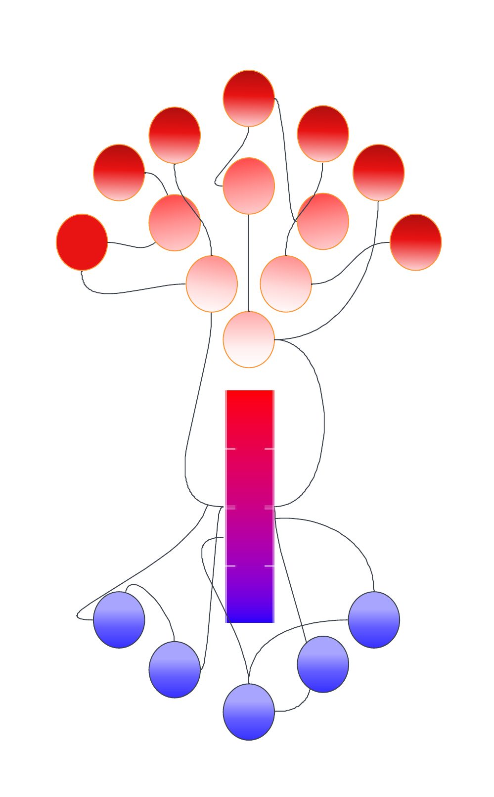
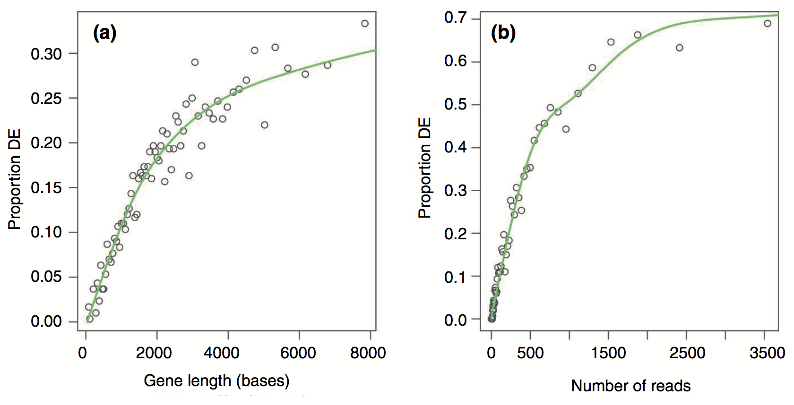

# Functional analysis

::: {.grid}
::: {.g-col-4}
{width=100%}
:::
::: {.g-col-8 .d-flex .align-items-center}
*Functional analysis is the process of taking a list of genes which we cannot meaningfully interact with and distilling information that we as researchers can then interpret. Generally, this involves grouping genes based on functions or processes, and determining which processes or functions appear to be different between your experimental groups.*  
:::
:::


There are different approaches to functional analysis *e.g.,*:

-   **Over-representation analysis**: are certain processes, pathways or biological functions over-represented in a list of differentially expressed genes relative to the background genome (often called Gene Ontology analysis).

-   **Functional class scoring (Gene Set Enrichment Analysis (GSEA))**: Rather than taking a list of differentially expressed genes (which are themselves based on thresholds and cutoffs defined by a user), GSEA takes the ranked position of all genes to see how pathways and processes are perturbed.

-   **Pathway topology**: Pathway topology analysis takes a higher level approach, compiling information on up- and down-regulation at the level of the pathway rather than the level of the gene.

Today we will cover **over-representation analysis** and functional class scoring.
Links to pathway topology workflows are provided.

## Annotation

The basis of this stage of the analysis is to take individual genes, associate them with a function, and then to identify whether there are common themes of function in genes which have undergone changes in gene expression.

This first requires that our genes are annotated - we must be able to associate some type of function or process with a given gene.
There are now many databases that maintain information and annotation on genes, including proposed and confirmed functions, pathways, processes *etc.,*.
Annotation and databases is an entire area in itself, and not something we can cover today.
For now, we will retrieve annotation information from different sources and attach the annotation to genes.

The annotations that we are going to be using today are called **Gene Ontologies** or GO terms. There are three major classes of GO -- **Molecular Function (MF)**, **Cellular Component (CC)**, and **Biological Process (BP)**. GO terms are hierarchical, and each child term is more specialised than the parent term. Check out the [documentation here on gene ontologies.](https://geneontology.org/docs/ontology-documentation/) 


## Over-representation Analysis

### The hypergeometric distribution

Let's say you have a list of 100 differentially expressed genes and, after annotation, you notice that 10 of these genes are involved in apoptosis.
Is this a significant finding?
Initially, you might think that *yes* it is significant, since 10% of your genes of interest share a role.
However, to understand whether this is significant we need to consider the number of apoptosis-related genes in the genome.
If, for example, we find that 12% of all genes in the genome are annotated as apoptosis-related, then seeing 10% of your differentially expressed genes with this annotation isn't significant - it's approximately what you would have expected.
However, if you'd found 25% (or 0%!) THEN you might have something significant.

Over-representation analysis is the use of a hypergeometric distribution to determine whether or not a sample group is undergoing coordinated gene expression changes.
Statistically, it is asking what is the probability of getting 10 apoptosis genes in my list of 100 differentially expressed genes, given the number of apoptosis genes in the whole genome.

::: {.callout-warning collapse="true"}
# A word of warning about defining your background gene list
Here we use the whole genome to generate our background gene list. This approach may not always be appropriate, and it is up to you to decide what is the most biologically appropriate gene list to use as the background. For example, if you are comparing gene expression across samples from a tissue type that is known to be naturally high in apoptotic procesess, then using the whole genome as a background gene list may 'drown out' the signal. Instead, you may want to use all of the genes that are generally known to be expressed in that tissue as your background (e.g., this could be by using a set of control samples, or by using all genes detected as differentially expressed in all your samples together).
:::

We can use the Fisher's Exact test and the hypergeometric distribution to ask whether being involved in apoptosis is independent of being significantly differentially expressed.

What does this look like in practice?
We can use a 2 x 2 table, where the four data points are (from top left to bottom right): the number of genes that are **both** in the category and are differentially expressed, the number of *differentially expressed genes* not in the category, the number of *category genes* that are not differentially expressed, and the number of genes that are **neither** in the category nor differentially expressed.

Let's attach some real numbers to those categories and visualise them.
We have 10 apoptosis genes in our 100 differentially expressed genes, there are 500 genes annotated as apoptosis, and a total of 10,000 genes in the genome.

```{r}
hypergeoDistMatrix <- matrix(c(10,490,90,9410),2,2)
hypergeoDistMatrix
```

**Quickly, where did these numbers come from?**

Top left: 10 differentially expressed genes which are apoptosis related.

Top right: 90 genes that are differentially expressed but are *not* apoptosis related.

Bottom left: 490 genes that are apoptosis related but not differentially expressed.

Bottom right: 9410 genes that are neither differentially expressed or apoptosis related.

Row 1 sums to 100 (differentially expressed genes)

Row 2 sums to 9,900 (non-differentially expressed genes)

Col 1 sums to 500 (apoptosis genes)

Col 2 sums to 9,500 (non-apoptosis genes)

Now we can test for an association - or, more accurately, we can test the null hypothesis that being in the apoptosis category is independent of being in the differentially expressed category.

```{r}
fisher.test(hypergeoDistMatrix)
```

The p-value of 0.033 let's us reject the null hypothesis and we conclude there is an association.
In our hypothetical experiment, apoptosis-related genes are over-represented (enriched) in our differentially expressed gene list.

We don't want to perform this test manually for every possible functional category (adjusting for multiple testing as we go), so we will look to existing software packages to do this for us.
But first, let's look at some caveats and considerations.

### Caveats

The hypergeometric distribution and Fisher's test makes the assumption that all genes are equal.
As an exercise, take 30 seconds to think about the ways that genes might not be equal, about RNA-sequencing, and what impact this could have on our test.

One major difference when looking across genes is gene length.
RNA-seq tends to produce greater counts for longer genes, which is itself worth remembering, and this gives these genes a greater chance of being statistically differentially expressed.
An additional problem is that some gene sets tend to be made up of primarily long genes (because certain processes or functions may require large, complex proteins).
Because long genes have a greater chance of being differentially expressed, gene sets which are made up of long genes will have a greater chance of being enriched or over-represented.

We must carry out some type of correction for gene length when conducting over-representation analyses.

### GOseq

We will begin with a method called GOseq, which was developed as part of one of the publications initially identifying the gene length bias.
An illustration from the [full paper](https://genomebiology.biomedcentral.com/articles/10.1186/gb-2010-11-2-r14) is below, demonstrating the relationship between differential gene expression and gene length and between differential expression and number of reads.


There is a strong positive correlation between differential gene expression and both total gene length and number of reads.
Unless corrected for, gene length will bias your over-representation analysis.

Load the goseq package, the dplyr package (if you haven't already), and use the `supportedOrganisms()` function to check whether your organism of interest is supported.
The code for *Saccharomyces cerevisiae* is sacCer.

```{r}
#| message: false
#| output: false
# BiocManager::install("goseq")

library(dplyr)
library(goseq)

supportedOrganisms() %>% View()
```

We need to create an object that will pass GOseq a list of all our genes, with the differentially expressed genes highlighted.
To do this, we will use an `ifelse()` statement which will check every gene in our experiment and ask test if it has an adjusted p-value of less than 0.05.
If adj-p-value is \< 0.05, return a "1" and if greater than (or equal to) 0.05, return a "0".
After that, add the gene names to this vector of 1s and 0s.

Note #1: at the end of the previous exercise we also applied a logFC threshold for defining differentially expressed.
We won't use that here and will just use adjusted p-values for simplicity.

Note #2: the tt object was created when we used limma to identify differentially expressed genes.
tt is 7,127 rows, and has genes stored as row names, includes the logFC, and adj.P.Val columns.

```{r}
load("tt.RData")

genes <- ifelse(tt$adj.P.Val <= 0.05, 1, 0)

names(genes) <- rownames(tt)

head(genes)

tail(genes)
```

Note #3: because tt is ordered (that is, all the genes with low p values are at the top), it's worth using tail to check the bottom of the new genes object looks different to the top.
Another useful check is to use the `table()` function to ask how many genes fall into each category.

```{r}
table(genes)
```

This is a useful reminder about the conditions of this experiment: of the 7,127 genes in the tt object, 5,140 are differentially expressed.
Most experiments will not have this level of differential expression.

::: {.callout-note collapse="true"}
# IF you did want to include the logFC cutoff, you can use the code below...

```{r}
genes2 <- ifelse(tt$adj.P.Val <= 0.05 & (abs(tt$logFC) > log2(2)), 1, 0)
names(genes2) <- rownames(tt)
table(genes2)
```

This gives a more modest 1,891 differentially expressed genes.
For the purposes of today's workflow, we will continue with the larger gene list.

:::


#### Methodology

What is GOSeq doing?
How does it correct for gene length?

Remember that we will still use the hypergeometric distribution and Fisher's Exact test with the 2 x 2 table.
Because we know that longer genes are more likely to in the differentially expressed category, we can think of this category as *having more weight than it should*.
GOSeq will calculate a value for each gene which will offset this artificial weight.
In other words, if our 2 x 2 table would have 10 genes in the top left square, and some of those genes are very long, GOSeq will treat the number as something slightly less than 10.
By treating the value as less than 10, we have taken into account the fact that there shouldn't *really* have been 10 genes in there in the first place if not for gene length bias.

Calculate the weighting that should be assigned to each gene with the Probability Weighting Function (the `nullp()` function).  

- Specify the object "gene" which is our list of all genes and whether they are differentially expressed or not, as a binary named vector  
- Specify the genome ("sacCer1" for our yeast genome)  
- Specify the gene ID type (in this case, we are using ensembl Gene IDs)  

This will create a plot in which genes are placed into "bins" based on length, and then gene length vs proportion of differentially expressed is plotted.
We can then inspect the pwf object.

Note: you will frequently get a *Warning in pcls(G): initial point very close to some inequality constraints* message when running `nullp()`. You can ignore this.  


```{r}
pwf <- nullp(genes, "sacCer1", "ensGene")

pwf %>% head()

pwf %>% tail()
```

Here we can see that genes have been given a different pwf value based on the bias.data column.
The pwf value will be less than 1, and indicates how much a gene should be 'counted for' if it is in the differentially expressed category in the 2 x 2 table.

We can predict that pwf and bias (length) are opposing values, and we can visualise that data:

```{r}
par(mfrow=c(1,2))
hist(pwf$bias.data,30)
hist(pwf$pwf,30)
```

We have a large number of genes which have low/no bias, and a correspondingly high number of genes with the max pwf weighting.
A smaller number of genes have a greater bias and are given lower weighting.

We can now carry out our Fishers Exact test using the pwf value instead of the raw counts.
We will use the `goseq()` function to perform this test, and output the over-representation data into an object.

```{r}

# BiocManager::install("org.Sc.sgd.db")
# BiocManager::install("AnnotationDbi")
library(org.Sc.sgd.db)

GO.wall = goseq(pwf, "sacCer1", "ensGene")

GO.wall %>% head()
```

We will want to filter for only those categories with an adjusted p-value \< 0.05, and save that information to a new object for easy browsing.

You might have noticed that the GO.wall object doesn't automatically perform an adjustment for multiple testing, so we will use the `p.adjust()` function to generate corrected p-values.

We will then use the adjusted p-values as a filtering criteria, and include the columns that correspond to category, term, and ontology (using the `colnames()` function, we can see that these are columns 1, 6 and 7).

```{r}
GO.wall.padj = p.adjust(GO.wall$over_represented_pvalue, method="fdr")

sum(GO.wall.padj < 0.05)

GO.wall.sig = GO.wall[GO.wall.padj < 0.05, c(1,6,7)]

GO.wall.sig %>% dim()

GO.wall.sig %>% head()
```

An optional filtering step can be applied here, which is to remove categories that have a large number of genes.
Categories which have a large number of genes tend to be very broad terms, which are not very informative *e.g.,* the categories "organelle", "biological_process", and "protein localization".

If you choose to apply this filter, re-make the GO.wall.sig object.
Here we are filtering with a requirement that the category contains fewer than 500 genes. 

```{r}
GO.wall.sig <- GO.wall[GO.wall.padj < 0.05 & GO.wall$numInCat < 500, c(1,6,7)]

GO.wall.sig %>% dim()

GO.wall.sig %>% head()
```

This is a very useful way of getting a broad overview of what processes our differentially expressed genes are involved in.
The final step we will take here is to use the GO.db package to retrieve more detailed information about the categories we have identified.
GO.db will use the unique identifier in the category column and provide more information.

```{r}
library(GO.db)

GOTERM[[GO.wall.sig$category[1]]]
```

### Closing thoughts on GOseq

GOSeq is a powerful tool that corrects for an important bias in RNA-seq data. There are other options when it comes to over-representation analysis, and functional analysis in general. Some of these tools might help with generating better visualisations, or claim to have more up-to-date databases. 


## Gene set enrichment analysis and clusterProfiler

We will not complete a full demonstration of gene set enrichment analysis (GSEA) and clusterProfiler, but we will give an overview of these techniques and tools. 

In particular we strongly recommend The Carpentries workshop [RNA-seq analysis with Bioconductor](https://carpentries-incubator.github.io/bioc-rnaseq/instructor/07-gene-set-analysis.html#ora-with-clusterprofiler) section on GSEA. 


### GSEA

GSEA takes an alternative approach to the previous section in that it does not take as input a list of differentially expressed genes. GSEA moves away from the binary "differentially expressed or not" approach and considers the state, or position, of all genes in the list. 

This approach has the advantage of not relying on our somewhat arbitrary cutoff thresholds (*e.g.,* a gene with a p-value 0.0501 probably should still contribute to what we think is happening to a pathway). 

### ClusterProfiler

ClusterProfiler is a widely used package with the support to create *excellent* figures ([check these out](https://carpentries-incubator.github.io/bioc-rnaseq/instructor/07-gene-set-analysis.html#visualization)). 

### GSEA, clusterProfiler and length correction

GSEA and clusterProfiler do not implement a gene length correction. Does this invalidate them as options? We argue that it does not. Even without length correction, GSEA is implementing a powerful and logical approach and the visualisations made with clusterProfiler should not be under-valued. 

In any situation where there are multiple tools, methods, or decision points (*e.g.,* thresholds, removal of outliers *etc.,*) it is recommended that you complete the analyses and compare the outcomes. It is possible to run GOSeq *without* the length correction implemention (shown below) and compare the over-represented categories. If the difference is large, then you should be cautious when interpreting GSEA results or the output of clusterProfiler. 

```{r}
GO.nobias=goseq(pwf, "sacCer1", "ensGene", method="Hypergeometric")
```

