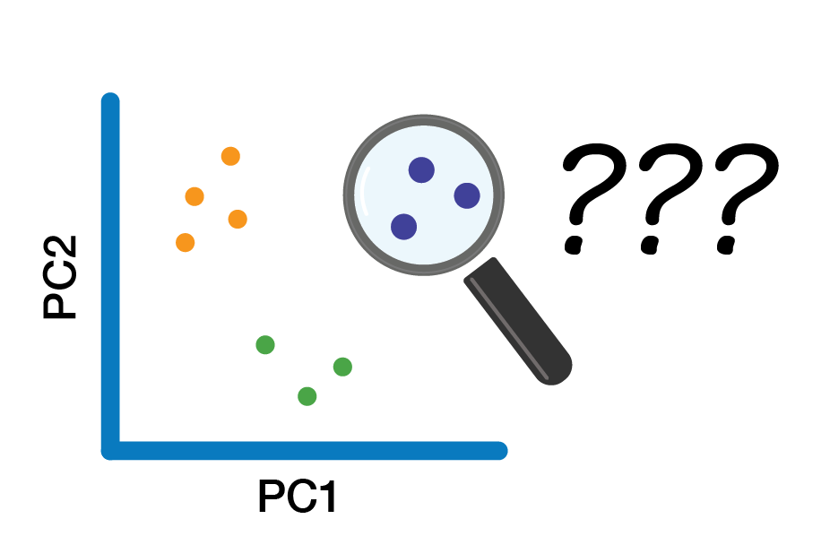

# Exploratory Analysis

{width=80% fig-align="center"}


Exploratory analysis is will cover basic visualisations and characterisations of the data as well as any initial transformations (*e.g.,* library size) required before we move on to identifying differentially expressed genes. 

## What is exploratory analysis and why is it necessary?

Exploratory analysis is looking at the data. You are attempting to get a sense of what the data looks like, to notice outliers or issues (*e.g.,* hey isn't it weird that one of my wt samples groups with all the mutant samples, and one of the mut samples groups with the wt samples? I wonder what's happening there?).

If your data set was a physical problem (like a squeaky wheel or a well wrapped present) you'd physically explore it (pick it up, is it heavy, do I shake it?). Exploratory analysis is the data science equivalent.

## Exploratory analysis

From here and for the rest of the workshop, we will be working within R. Use the import data set or `read.delim()` function to import the file counts, and name the object counts. Also, load the dplyr library. We will look at some of the basic stats and features of our data object with `View()`, `dim()`, and `names()`

In the previous sections we generated counts for 3 samples. We are going to need a few more samples for the rest of this workshop when we explore gene expression, so we are loading in a counts file with 15 samples. 

We have 3 phenotype groups, each with 5 biological replicates:

- F = female gonad samples  
- MT = mid-transitioning gonad samples  
- TPM = terminal phase male gonad samples  


```{r}
#| message: false

library(tidyverse)


```


Run the code below to load the file:

```{r}
#| eval: false

counts <- read.delim("~/RNA_seq/data-files/counts.txt", comment.char="#")
```

```{r}

coldata <- read.table("/Users/vanch93p/Library/CloudStorage/OneDrive-UniversityofOtago/GenomicsAotearoa/Workshops_GA/testing-new-content/RNAseq-new-content/rnaseq-spotty/data-files/coldata.txt", sep="\t", header=TRUE)
counts  <- read.table("/Users/vanch93p/Library/CloudStorage/OneDrive-UniversityofOtago/GenomicsAotearoa/Workshops_GA/testing-new-content/RNAseq-new-content/rnaseq-spotty/data-files/counts.txt",  sep="\t", header=TRUE, row.names=1)

```

::: {.callout-note collapse="true"}
# Want to load this dataset on your own computer?

If you are completing this workshop on your own local machine, run the code below to load the file from Github:

```{r}
#| eval: false


counts <- read.delim("https://raw.githubusercontent.com/GenomicsAotearoa/RNA-seq-data-analysis-workflow/main/data/yeast_counts_all_chr.txt", comment.char="#")
```
:::


Now let's take a look at the counts data.
```{r}

counts |> head()

ncol(counts)
```

Let's look at the metadata we have for these samples:

```{r}

coldata |> head()

```

The first column has all our sample names, which match exactly the column names in our counts table. We then have multiple columns that contain various metadata about our samples, including whether or not samples were part of control (C) or treatment (T) groups, the histologically determined phenotype, timepoint columns and the original length and weight of the fish that the gonad was retrieved from. 


## Remove non-expressed genes (optional)

If you are working in a complex organism, many genes will not be expressed in all tissue types. It can be worth checking to see how many genes have zero counts and opting to remove these from your data object.

How many genes have counts of zero? What's the distrubution of our counts?

```{r}

colSums(counts == 0)

summary(counts)
```


Zero counts automatically removed during DEseq, but for visualisation need to deal with them. either remove very low counts or add 1 (when logging). 

We'll cover ways to filter out lower counts 


## Visualising our data set

### Count distribution

```{r}


# Convert counts data to long format for ggplot
counts_long <- counts %>%
  as.data.frame() %>%
  tibble::rownames_to_column("Gene") %>%
  tidyr::pivot_longer(cols = -Gene, names_to = "sample", values_to = "Counts")

# Create boxplot with ggplot2
ggplot(counts_long, aes(x = sample, y = Counts)) +
  geom_boxplot() +
  labs(x = "Samples", y = "Counts") +
  theme_minimal() 


```


This figure indicates we should consider logging our data (for the purpose of visualisations).

Log2 transform the data, adding 1 to avoid log(0) errors.

We use log2 for counts for RNAseq - more on why later!


```{r}


# create new df that includes counts in long form and all metadata in the coldata
counts_long_metadata <- counts_long |> 
  left_join(coldata, by = "sample")  |>
  mutate(sample = fct_reorder(sample, histology))

# Create log2 counts boxplot with ggplot2
ggplot(counts_long_metadata, aes(
  x = sample,
  y = log2(Counts + 1),
  fill = histology)) +
  geom_boxplot() +
  labs(x = "Samples", y = "Log Counts +1") +
  theme_minimal() +
  theme(axis.text.x = element_text(angle = 45, hjust = 1))

```


The log count boxplots reveal there may be some differences between our three sample groups. The average counts for the TPM (terminal phase males) group *appear* (we have not done any statistical analysis yet!) to be higher than the other two sample groups, F (female) and MT (mid-transitioning). 


::: {.callout-warning}
# WARN!

this isnt a count of how many genes are exprssed per sample, this is the distribution of how expressed every gene in in the sample.


:::


A common question to ask at this point is, are the differences we can see between our two sample groups a true biological effect, or is this an experimental artifact? Often, we will not know the answer to this question. For now, it is enough to be aware of these differences and to keep them in mind moving forward.

### Library size

Library size refers to the total number of reads for the entire sample. If two samples have vastly different library sizes, genes would look differentially expressed between samples e.g., if one library was twice as large as another, all genes would look to be upregulated in the larger library sample. Before we compare counts across samples we need to check whether the library sizes are approximately similar, and if they are not, make a correction to account for the size differences.

In this code below, focus on what we are trying to *do* with the code rather than the code itself. For each sample in our counts object, we are adding up the total counts across every gene to calculate the library size. There are different ways you could achieve this in R, but if you understand the end goal you can find your own path.  


```{r}

library(forcats)
#fct_reorder() comes from forcats

colSums(counts) %>%
  as.data.frame() %>%
  setNames("reads") %>% 
  tibble::rownames_to_column("sample") %>%
  left_join(coldata, by = "sample") %>%
  mutate(sample = fct_reorder(sample, histology)) %>% 
  ggplot(aes(x = sample, y = reads, fill = histology)) +
  geom_col(colour = "black") +
  labs(
   y = "Reads mapped per sample",
   x = "Sample",
   title = "Library size") +
  theme_classic() +
  theme(axis.text.x = element_text(angle = 45, hjust = 1))
```


Library sizes differs a bit across the samples and it *appears* (still no statistics performed yet!) there is a trend in differences between groups. This indicates it will be important to correct for library size, which can be achieved by calculating a sample-specific value called a size factor. If we take the raw read counts and divide by the size factor for each sample, the resulting values would be similar for all samples. The way in which size factors are implemented will differ depending on the analysis method used. For some methods the size factor must be manually used to correct for library sizes. For other methods (*e.g.,* DESeq2, which we will use shortly) automatically estimates size factors and implements them into the differential gene expression analysis workflow.

### Principal Component Analysis 

A principal component analysis (PCA) is linear dimensionality technique that can be used as a way to visualise sample-to-sample distances. In this ordination method, the data points (*i.e.,* here, the samples) are projected onto the 2D plane such that they spread out in the two directions which explain most of the differences in the data. The x-axis is the direction (or principal component) which separates the data points the most (PC1). The amount of the total variance which is contained in the direction is printed in the axis label. The y-axis shows the next most variance (principal component 2). More principal components (PC3, PC4 and so forth) can also be extracted and plotted to investigate trends in the data. 

In simple turns, we are making a plot that shows us how similar or different each sample is, taking in to account all of the gene expression. A PCA plot can help us see the biggest sources of biological variation and help determine which has more of an affect on the gene expression – whether that be the treatment type, the tissue type or something else (*e.g.,* an unintended batch effect or outliers).  

First, we need to remove all genes with zero counts across all samples. 
```{r}
counts_filtered <- counts[rowSums(counts) > 0, ]
```

Next the counts object needs to be flipped for `prcomp()` analysis.

Our counts dataframe currently looks like this:

```
        Sample 1   Sample 2   Sample 3
geneA   1          3          4
geneB   46         986        60
geneC   0          0          2

```

But we need to transpose it to look like this:

```
           geneA     geneB     geneC
Sample 1   1         3         4
Sample 2   46        986       60
Sample 3   0         0         2

```

Use the function `t()` to transpose the table. Raw RNAseq counts should not be used for PCA due to issues with library size difference (which we saw above) and heteroscedasticity (variance is dependant on the mean). There are multiple transformations we could do (log2, rlog, vst – variance stabilizing transformation) to normalise the counts. We'll log2 the data here (later we'll use the `vst()` function from the `DEseq` package) and we can do this at the same time as transposing. We still need to add 1 – some zeros will remain in the dataset as only genes with zeros for *all* samples are removed. 

```{r}
pca <- prcomp(t(log2(counts_filtered +1)))
str(pca)
```

The PCA object is a list with several attributes we will pull out for plotting.

What we don't currently have loaded in is our metadata, which we'll want for plotting. Let's pull out the PC data, convert rownames to a column so that the sample names can be matched to the coldata dataframe using left join. 

```{r}
pca_data <- as.data.frame(pca$x) %>%
  tibble::rownames_to_column("sample") %>%
  left_join(coldata, by = "sample")

head(pca_data)
```
Now we have a data frame with a column each for sample name, each of the PCs, and each of our metadata variables. 

We can also pull out the sdev values from our pca object into a vector to use this for plotting in a moment too:

```{r}
pct_var <- round(100 * pca$sdev^2 / sum(pca$sdev^2),1)
pct_var
```


Now we are ready to plot our data, which we can do using a ggplot scatterplot. There are functions that automatically build PCA plots (*e.g.,* `ggfortify::autoplot(pca)` or `DESeq2::plotPCA(vsd, intgroup="condition")` ), rather than building them from scratch with ggplot2, but they have slightly less flexibilty than using ggplot2. 

```{r}

ggplot(pca_data, aes(x = PC1, y = PC2, colour = histology)) +
  geom_point(size = 4) +
  labs(x = paste0("PC1: ", pct_var[1], "% variance"),
       y = paste0("PC2: ", pct_var[2], "% variance")) +
  theme_classic()
```

##### DISCUSSION 🧠🏋️‍♀️ (3 mins)

What's the next thing we might want to plot using PCA data to investigate trends in our data? 

::: {.callout-tip collapse="true"}
# SOLUTION
The next thing we should test is **batch effect**. We have two different experimental batches that our data was generated from – one in 2016 (SI16) and one in 2018 (SI18). We can change the shape of the points to show batch and we can add labels for the points too:

```{r}

ggplot(pca_data, aes(x = PC1, y = PC2, colour = histology, shape = batchname)) +
  geom_point(size = 4) +
  geom_text(aes(label = sample), nudge_y = 15, size = 3) +
  labs(x = paste0("PC1: ", pct_var[1], "% variance"),
       y = paste0("PC2: ", pct_var[2], "% variance")) +
  theme_classic()
```

What patterns do you see?

- Is sample SI16_22G an outlier and should we remove it?
- Do we have enough samples from each batch in each group to determine whether we are seeing batch effects?

Answer: SI16_22G is potentially worth removing. With only 5 samples per histology group, the batch split is at best 2:3, making it difficult to confidently distinguish batch effects from biological signal. The MT group in particular has only 1 SI16 sample and 4 SI18 samples. That said, samples largely cluster by histology group, suggesting histology is the stronger driver of variance – batch effects may be present but appear secondary. 

:::


### Next up ...

After exploring our dataset, removing any outliers and deciding which factors we may need to correct for that are causing batch effects, we are now ready to move onto differentially gene expression analysis. 
