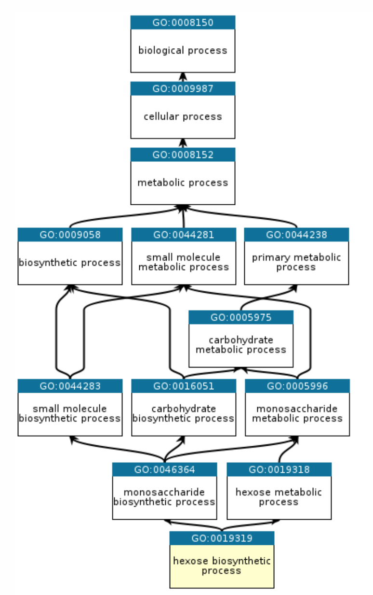

# Functional analysis

::: {.grid}
::: {.g-col-4}
{width=100%}
:::
::: {.g-col-8 .d-flex .align-items-center}
Functional analysis is the process of taking a list of genes which we cannot meaningfully interact with and distilling information that we as researchers can then interpret. Generally, this involves grouping genes based on functions or processes, and determining which processes or functions appear to be different between your experimental groups. 
:::
:::


There are different approaches to functional analysis *e.g.,*:

-   **Over-representation analysis**: are certain processes, pathways or biological functions over-represented in a list of differentially expressed genes relative to the background genome (often called Gene Ontology analysis).

-   **Functional class scoring (Gene Set Enrichment Analysis (GSEA))**: Rather than taking a list of differentially expressed genes (which are themselves based on thresholds and cutoffs defined by a user), GSEA takes the ranked position of all genes to see how pathways and processes are perturbed.

-   **Pathway topology**: Pathway topology analysis takes a higher level approach, compiling information on up- and down-regulation at the level of the pathway rather than the level of the gene.

Today we will cover **Over-representation analysis using GOseq** 

## Annotation

The basis of this stage of the analysis is to take individual genes, associate them with a function, and then to identify whether there are common themes of function in genes which have undergone changes in gene expression.

This first requires that our genes are annotated - we must be able to associate some type of function or process with a given gene.
There are now many databases that maintain information and annotation on genes, including proposed and confirmed functions, pathways, processes *etc.,*.
Annotation and databases is an entire area in itself, and not something we can cover today.
For now, we will retrieve annotation information from different sources and attach the annotation to genes.


::: {.grid}
::: {.g-col-5}
[{width="100%"}](https://amigo.geneontology.org/amigo/term/GO:0019319)
:::
::: {.g-col-6 .d-flex .align-items-center}
The annotations that we are going to be using today are called **Gene Ontologies** or GO terms. There are three major classes of GO -- **Molecular Function (MF)**, **Cellular Component (CC)**, and **Biological Process (BP)**. GO terms are hierarchical, and each child term is more specialised than the parent term. Check out the [documentation here on gene ontologies](https://geneontology.org/docs/ontology-documentation/). On the left is an example gene ontology hierarchy for the hexose biosynthetic process term.
:::
:::

### Bioconductor annotation packages

In this workshop, we are using a dataset from the New Zealand Spotty wrasse species *Notolabrus celidotus*, which does not have a dedicated annotation package. However, there are many species which do have dedicated annotation packages, and these can be used to retrieve gene ontology information for your genes of interest.

You can check if your research organism has a Bioconductor organism package with Genome wide annotations [by searching this list here](https://bioconductor.org/packages/release/BiocViews.html#___OrgDb). If your species is listed, it is relatively simple to perform GOseq analysis and you should not follow the method outlined here. The Bioconductor approach is used for our [alternative RNAseq workshop](https://genomicsaotearoa.github.io/RNA-seq-data-analysis-workflow/) which uses the yeast *Saccharomyces cerevisiae* for the example dataset.    


## Over-representation analysis - The hypergeometric distribution

Let's say you have a list of 100 differentially expressed genes and, after annotation, you notice that 10 of these genes are involved in apoptosis.
Is this a significant finding?
Initially, you might think that *yes* it is significant, since 10% of your genes of interest share a role.
However, to understand whether this is significant we need to consider the number of apoptosis-related genes in the genome.
If, for example, we find that 12% of all genes in the genome are annotated as apoptosis-related, then seeing 10% of your differentially expressed genes with this annotation isn't significant - it's approximately what you would have expected.
However, if you'd found 25% (or 0%!) THEN you might have something significant.

Over-representation analysis is the use of a hypergeometric distribution to determine whether or not a sample group is undergoing coordinated gene expression changes.
Statistically, it is asking what is the probability of getting 10 apoptosis genes in my list of 100 differentially expressed genes, given the number of apoptosis genes in the **background gene list.**


::: {.callout-note collapse="true"}
# Using Fisher's Exact test and the hypergeometric distribution 

We can use the Fisher's Exact test and the hypergeometric distribution to ask whether being involved in apoptosis is independent of being significantly differentially expressed.

What does this look like in practice?
We can use a 2 x 2 table, where the four data points are (from top left to bottom right): the number of genes that are **both** in the category and are differentially expressed, the number of *differentially expressed genes* not in the category, the number of *category genes* that are not differentially expressed, and the number of genes that are **neither** in the category nor differentially expressed.

Let's attach some real numbers to those categories and visualise them.
We have 10 apoptosis genes in our 100 differentially expressed genes, there are 500 genes annotated as apoptosis, and a total of 10,000 genes in the genome.

```{r}
hypergeoDistMatrix <- matrix(c(10,490,90,9410),2,2)
hypergeoDistMatrix
```

**Quickly, where did these numbers come from?**

Top left: 10 differentially expressed genes which are apoptosis related.

Top right: 90 genes that are differentially expressed but are *not* apoptosis related.

Bottom left: 490 genes that are apoptosis related but not differentially expressed.

Bottom right: 9410 genes that are neither differentially expressed or apoptosis related.

Row 1 sums to 100 (differentially expressed genes)

Row 2 sums to 9,900 (non-differentially expressed genes)

Col 1 sums to 500 (apoptosis genes)

Col 2 sums to 9,500 (non-apoptosis genes)

Now we can test for an association - or, more accurately, we can test the null hypothesis that being in the apoptosis category is independent of being in the differentially expressed category.

```{r}
fisher.test(hypergeoDistMatrix)
```


The p-value of `r round(fisher.test(hypergeoDistMatrix)$p.value, 3)` let's us reject the null hypothesis and we conclude there is an association.
In our hypothetical experiment, apoptosis-related genes are over-represented (enriched) in our differentially expressed gene list.

We don't want to perform this test manually for every possible functional category (adjusting for multiple testing as we go), so we will look to existing software packages to do this for us.

:::


### Caveats

The hypergeometric distribution and Fisher's test makes the assumption that all genes are equal.
One major difference when looking across genes is **gene length.**
RNA-seq tends to produce greater counts for longer genes, which is itself worth remembering, and this gives these genes a greater chance of being statistically differentially expressed.
An additional problem is that some gene sets tend to be made up of primarily long genes (because certain processes or functions may require large, complex proteins).
Because long genes have a greater chance of being differentially expressed, gene sets which are made up of long genes will have a greater chance of being enriched or over-represented.

We must carry out some type of correction for gene length when conducting over-representation analyses, which is built in to the GOSeq analysis pipeline. 

### GOseq

We will begin with a method called GOseq, which was developed as part of one of the publications initially identifying the gene length bias.
An illustration from the [full paper](https://genomebiology.biomedcentral.com/articles/10.1186/gb-2010-11-2-r14) is below, demonstrating the relationship between differential gene expression and gene length and between differential expression and number of reads.


There is a strong positive correlation between differential gene expression and both total gene length and number of reads.
Unless corrected for, gene length will bias your over-representation analysis.


#### Create gene lists 
The first thing we need to do is create a vector of our gene lists.  We must split our differentially expressed genes into upregulated and downregulated genes for each condition. In this example we are going to use an adjusted pvalue of 0.05 and a logFC of 1 as our cutoffs, but you can decide for your own data if you want to be more or less stringent. We'll use the DESeq results, but you could chose to use the limma results or the genes that overlap both methods.  

```{r}
#| echo: false
#| message: false

library(DESeq2)
library(tidyverse)

load("results/deseq2-FvsTPM.RData")
load("results/dds.RData")

```

```{r}

DE_genes_UP <- as.data.frame(res_F_vs_TPM[res_F_vs_TPM$padj <= 0.05 & res_F_vs_TPM$log2FoldChange < -1,])
DE_genes_DOWN <- as.data.frame(res_F_vs_TPM[res_F_vs_TPM$padj <= 0.05 & res_F_vs_TPM$log2FoldChange > 1,])

# Convert to vector of gene names by pulling out the rownames
DE_genes_UP <-  rownames(DE_genes_UP)
DE_genes_DOWN <- rownames(DE_genes_DOWN)

length(DE_genes_UP)
length(DE_genes_DOWN)
```


#### Create background gene list

For this workshop, we'll create a background gene list by taking all mapped genes from the dds object (you could also take this from the counts dataframe, as they both contain the same number of genes).  

::: {.callout-warning collapse="false"}
# A word of warning about defining your background gene list
You need to think carefully about which genes you want to use as your background gene list. Generating it is fairly straight forward, but it has implications for the analysis. Read more in this paper on [“Ten common mistakes that could ruin your enrichment analysis”](https://doi.org/10.1371/journal.pcbi.1014122) by Bora, McKenzie and Ziemann, 2026. The simplest option for the background is to use all genes that are expressed in your dataset (removing non-expressed and very lowly expressed genes). However, it is up to you to decide what is the most biologically appropriate gene list to use as the background. For some organisms, *e.g.,* yeast, it may be acceptable to use all genes in the genome as the background, which is the approach used in our [alternative RNAseq workshop.](https://genomicsaotearoa.github.io/RNA-seq-data-analysis-workflow/)
:::

```{r}

background <- rownames(dds)
str(background)
```


#### Load in gene lengths and gene ontologies files

In this workshop we are not going to get [into the nitty gritty](https://genomicsaotearoa.github.io/genomics-mini-series/mini-series-gene-ontology.html) of how to generate or obtain these files, as there are a few potential avenues depending on the level of annotation available for your genome. For some genomes, gene ontologies are available as `.gaf` files which require only minimal data manipulation to prep for GOseq. Gene lengths are often not as readily available alongside the genome annotation files, but can be generated using packages such as `GenomicRanges` from GTF files, or if you use `featureCounts` to generate counts from your SAM/BAM file it outputs gene lengths.

We'll focus instead on what these files should look like so you have an idea of what you need to generate. 

```{r}
#| message: false

geneLengths <-  read.delim("data-files/genelengths.txt", header = TRUE, sep = "\t")
geneOntologies <- read.delim("data-files/geneontologies.txt", header = TRUE, sep = "\t")

geneLengths |> head()
```


The gene lengths object should be a dataframe, and needs to have one column with the GeneIDs (must match the geneIDs in your alignment/counts files) and one column with the length of the gene. We typically use the union exon length as a proxy for the gene length (*i.e.,* add together the number of bps in each exon). 


```{r}
geneOntologies |> head()
```

The gene ontologies object should be a dataframe, and needs to have one column with the GeneIDs (must match the geneIDs in your alignment/counts files) and one column for gene ontology terms. 

Some genes will have no GO annotations and these should be designated with a period "." (or an NA) 

Many genes will have multiple GO annotations and these should be a single string, separated by a "," or a ";"  

::: {.callout-caution appearance="minimal" collapse="true"}
# 🕵 Sanity check! 

The number of genes in your gene ontologies dataframe and your gene lengths dataframe should be the same, as there should be a single observation/row for each gene that we mapped to during alignment. This will generally be the same as the number of genes in your dds object, although sometimes you may filter out very low counts from your dds object, in which case this test would not be true. If so, check that the nrow of your original counts matrix dataframe match the lengths and ontologies.  

```{r}
nrow(geneOntologies) == nrow(geneLengths)  # should be true
nrow(geneOntologies) == nrow(counts(dds)) # usually true if no filtering for low count genes applied 
nrow(geneLengths) == nrow(counts(dds)) # usually true if no filtering for low count genes applied 

```


:::

#### Prepare data for GOSeq


Generate GO mapping structure, final object splitgoannot list 

```{r}
# split go annotations into a large list
splitgoannot <-  strsplit(geneOntologies[,2], split=',') 

# add the gene names to the list
names(splitgoannot) <-  as.vector(geneOntologies[,1])
```

Load in gene lengths, final object length.vector is a named vector 

```{r}
length.vector <- setNames(geneLengths$Length, geneLengths$GeneID)

# Force length.vector gene names to be in the same order as the background - important!
length.vector <- length.vector[background] 
```

> Note - gene lengths must be whole numbers. Use `as.integer(round(genelengths$Length))` if you have decimal places.


Create a binary vector of genes which are differentially expressed or not, final object genes is a named vector.

```{r}
DE.vector <- background  %in%  DE_genes_UP 
DE.vector <-  DE.vector * 1 
names(DE.vector) <-  background


# Last tests - important! Both need to be TRUE.
# If these are not both true you need to go back and debug.  
length(DE.vector) == length(length.vector) 
identical(names(length.vector), names(DE.vector))

```


#### Methodology

What is GOSeq doing?
How does it correct for gene length?

Longer genes are more likely to be in the differentially expressed category, we can think of this category as *having more weight than it should*.
GOSeq will calculate a value for each gene which will offset this artificial weight.


Calculate the weighting that should be assigned to each gene with the Probability Weighting Function (the `nullp()` function).  

We need to specify two things to the `nullp()` function:

- Specify the object "DE.vector" which is our list of all genes and whether they are differentially expressed or not, as a **binary named vector**  
- Specify the object "length.vector" which is our list of all genes and their lengths, as a **named vector**.


This will create a plot in which genes are placed into "bins" based on length, and then gene length vs proportion of differentially expressed is plotted.
We can then inspect the data.pwf object.

Note: you will frequently get a *Warning in pcls(G): initial point very close to some inequality constraints* message when running `nullp()`. You can ignore this.  

Load the goseq package and the dplyr package. 

```{r}
#| message: false
#| output: false
# BiocManager::install("goseq")

library(goseq)

```


```{r}

# Run PWF for length bias correction
data.pwf <- nullp(DEgenes=DE.vector, bias.data=length.vector)  

```


::: {.callout-note collapse="true"}
# More on PWF

If you read the note earlier on **Using Fisher's exact test and the hypergeometric distribution**, you have an idea already on how GOSeq works in the background. But there's a little more to understand about how GOseq corrects for gene length bias. 

In our 2 x 2 table example:
```{r}
hypergeoDistMatrix
```

The 10 genes in the top left square represent 10 DEGs which were related to our function of interest (apoptosis). If some of those genes are very long, GOSeq will treat the number as something slightly less than 10. By treating the value as less than 10, we have taken into account the fact that there shouldn't *really* have been 10 genes in there in the first place if not for gene length bias. This is what the PWF (probability weighting function) is doing - it is calculating a value for each gene which will offset this artificial weight.

```{r}
data.pwf |> head()

data.pwf |> tail()
```

Here we can see that genes have been given a different pwf value based on the bias.data column.
The pwf value will be less than 1, and indicates how much a gene should be 'counted for' if it is in the differentially expressed category in the 2 x 2 table.

:::

We can now carry out our Fishers Exact test using the pwf value instead of the raw counts.
We will use the `goseq()` function to perform this test, and output the over-representation data into an object.

Note: You will frequently get a note that *"For XX genes, we could not find any categories. These genes will be excluded."*  You can ignore this, it is because some genes do not have any GO annotations (marked with NA in the dataframe), and therefore cannot be included in the analysis. 


```{r}

GO.out <- goseq(data.pwf, gene2cat = splitgoannot)

```


```{r}

head(GO.out)
```


You might have noticed that the GO.out object doesn't automatically perform an adjustment for multiple testing, so we will use the `p.adjust()` function to generate corrected p-value for both the over and under represented p-value categories.

We will then use the adjusted p-values as a filtering criteria.


```{r}
library(dplyr)


GO.out <- GO.out |> 
  mutate(padj.over = p.adjust(over_represented_pvalue, method="fdr")) |> 
  mutate(padj.under = p.adjust(under_represented_pvalue, method="fdr")) 

```


#### Plot

We’re going to need a new column Gene Ratio for plotting. The Gene Ratio is the number of DE genes in the GO term divided by the total number of genes in that GO term. This is the proportion of DE genes with that GO term *e.g.,* a Gene ratio of 0.5 means that 50% of the genes in that GO term are DE.


```{r}
GO.out  <- GO.out  |>
  mutate(GeneRatio = numDEInCat / numInCat)
```

Now let's plot the top 10 over-represented GO terms for upregulated genes in TPM vs F. We will use the `ggplot2` package to create a bubble plot, where the x-axis is the Gene Ratio, the y-axis is the GO term, the size of the bubble is the number of DE genes in that GO term, and the colour of the bubble is the -log10 of the over-represented p-value.

```{r}
GO.out  |>
  filter(!is.na(ontology)) |>
  slice_min(padj.over, n = 10) |>
  ggplot(aes(x = GeneRatio,
             y = reorder(str_wrap(term, width = 35), GeneRatio),
             size = numDEInCat,
             colour = -log10(over_represented_pvalue))) +
  geom_point() +
  scale_colour_gradient(low = "steelblue", high = "firebrick",
                        name = "-log10(p-value)") +
  scale_size_continuous(name = "DE gene count", range = c(2, 10)) +
  labs(title = str_wrap("Over-represented GO terms for upregulated genes in TPM, vs F", width = 45),
       x = "Gene Ratio", y = NULL) +
  theme_bw()

```


#### Further processing and filtering 

Our output above contains both over-represented and under-represented GO terms for our upregulated genes from our TPM vs F pairwise comparison, which need to be considered separately.

For each pairwise comparison, we should end up with 4 objects or files:   

1. Upregulated genes - over-represented GO terms
2. Upregulated genes - under-represented GO terms
3. Downregulated genes - over-represented GO terms
4. Downregulated genes - under-represented GO terms

As you can imagine, this can end up being a lot of files if you have many pairwise comparisons!

You may also want to want to further filter for only significant GO terms.

Another optional filtering step can be applied here, which is to remove categories that have a large number of genes (more than 500, [recommended by GSEA](https://docs.gsea-msigdb.org/#GSEA/GSEA_FAQ/#7-how-many-genes-should-there-be-in-a-gene-set)). Categories which have a large number of genes tend to be very broad terms, which are not very informative *e.g.,* the categories "organelle", "biological_process", and "protein localization".

```{r}
# Chose a pvalue threshold
GOSEQ_SIGNIFICANCE_THRESHOLD <- 0.05

GO.out_TPM_UP_over  <- GO.out[GO.out$padj.over < GOSEQ_SIGNIFICANCE_THRESHOLD, ]
GO.out_TPM_UP_under <-GO.out[GO.out$padj.under < GOSEQ_SIGNIFICANCE_THRESHOLD, ]
```

```{r}

# Filtering to retain categories that contain fewer than 500 genes. 
GO.out_TPM_UP_over.filtered <- GO.out[GO.out$padj.over < 0.05 & GO.out$numInCat < 500, ]

```


##### Retrieving more information on GO terms

We can use the GO.db package to retrieve more detailed information about the categories we have identified.
GO.db will use the unique identifier in the category column and provide more information.

```{r}
#| message: false

library(GO.db)

GOTERM[[GO.out$category[1]]]
```


## Alternative approaches to functional analysis


### Gene set enrichment analysis (GSEA)

GSEA takes an alternative approach to the previous section in that it does not take as input a list of differentially expressed genes. GSEA moves away from the binary "differentially expressed or not" approach and considers the state, or position, of all genes in the list. 

This approach has the advantage of not relying on our somewhat arbitrary cutoff thresholds (*e.g.,* a gene with a p-value 0.0501 probably should still contribute to what we think is happening to a pathway). 

### ClusterProfiler

ClusterProfiler is a widely used package with the support to create *excellent* figures ([check these out](https://carpentries-incubator.github.io/bioc-rnaseq/instructor/07-gene-set-analysis.html#visualization)). 


::: {.callout-note collapse="true"}
# go enrichment plot

```{r}
#| message: false
# BiocManager::install(c("clusterProfiler", "enrichplot", "GO.db"))
library(clusterProfiler)
library(enrichplot)


# Step 1: reformat your geneOntologies into long format 
# clusterProfiler's enricher() needs a two-column dataframe:
#   col 1 = GO term  (TERM2GENE format: term first, gene second)
#   col 2 = gene ID
# You already have geneOntologies loaded (GeneID | GOs), so we just
# split the comma-separated GOs and pivot to long format.

term2gene <- geneOntologies |>
  filter(!is.na(GOs)) |>                          # drop genes with no annotation
  separate_rows(GOs, sep = ",") |>               # one row per GO term
  mutate(GOs = trimws(GOs)) |>                   # tidy any whitespace
  select(GOs, Symbol)                             # term first, gene second
# (enricher expects TERM2GENE with term in col 1, gene in col 2)

head(term2gene)
```

```{r}

# Step 2: download and generate term2name variable 
# We need the GO term and the name e.g., GO:0000001 and 'mitochondrion inheritance' for plotting
library(GO.db)

term2name <- AnnotationDbi::select(GO.db, keys = keys(GO.db), columns = c("GOID", "TERM"))
term2name <- dplyr::select(term2name, GOID, TERM) 

head(term2name)

```

```{r}

# Step 3: run enricher() 
# universe = your background gene list (same as goseq)
# gene     = your DE gene list (same as goseq, the character vector of our genes - not the named binary vector)


cp_result <- enricher(
  gene          = DE_genes_UP,
  universe      = background,
  TERM2GENE     = term2gene,
  TERM2NAME     = term2name,
  pvalueCutoff  = 0.05,
  qvalueCutoff  = 0.05,
  pAdjustMethod = "BH"
)


# Step 4: calculate semantic similarity
# emapplot requires the pairwise similarity between terms to be calculated first. This creates a similarity matrix. 
cp_result_sim <- pairwise_termsim(cp_result)


# Step5: Visualisation
emapplot(cp_result_sim, 
         showCategory = 30,         # change how many GOs on plot
         size_category = 1,         # change size of bubbles
         node_label_size = 3,       # change GO font size
         ) +    
  labs(title = "GO term enrichment map: upregulated genes in TPM, vs F")
```


:::


### Addtional resouces

https://carpentries-incubator.github.io/bioc-rnaseq/instructor/07-gene-set-analysis.html#ora-with-clusterprofiler