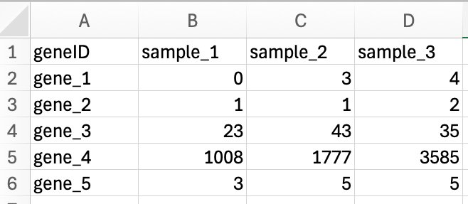
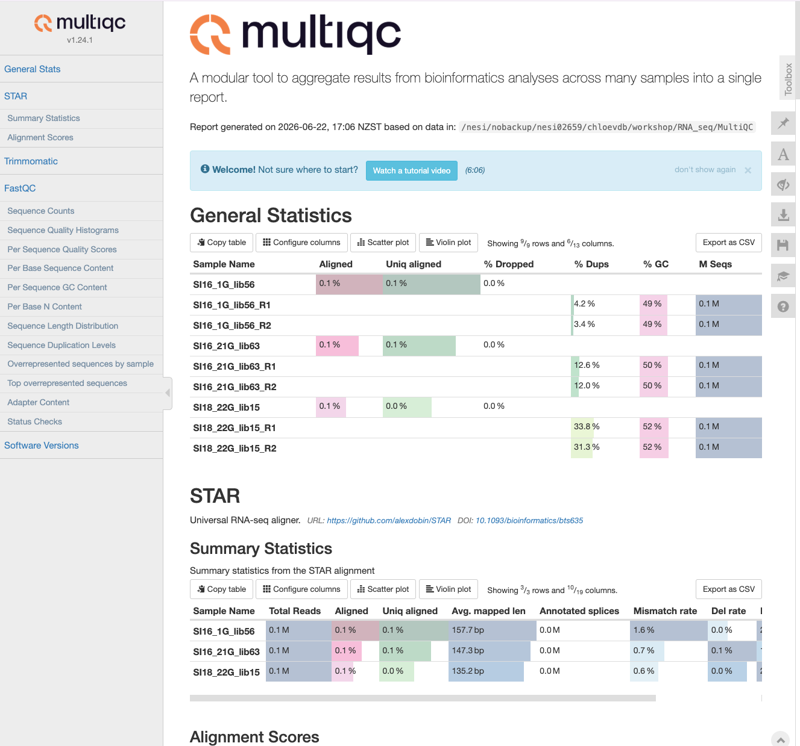

# Quantifying Gene Expression

{width=80% fig-align="center"}


In order to draw conclusions about gene expression from our reads, we need to first identify which region of the genome reads originated from and then quantify the number of reads from that region. There are many tools available to carry out quantification, and we will not cover the arguments for and against each tool. We encourage you to carry out a literature search, and discuss with experienced individuals in your field, before committing to a particular quantification procedure. Here we will give a brief overview of two approaches with considerably different underlying methodology, give an example tool for each, and then demonstrate one tool for the purpose of progressing to the next stage of our workflow.

The first approach to read quantification involves aligning reads to the genome first, and then counting the number of reads that are aligned to certain genomic features (*e.g.,* exons). This method may generally be referred to as the 'count' method, but it is still a form of quantification, and the output is by default at the gene level.  

The second approach, which we will not do today, involves creating transcript expression estimates via pseudoalignment, often referred to informally as 'pseudocounts'. In this method, reads are *not* aligned to the genome. Instead, they are pseudoaligned to kmers within the transcriptome and their abundance is estimated. While the output for these tools (e.g., Kallisto, Salmon) are by default at a transcript level, they can be converted to a gene level expression estimate.  

In today's workflow we will demonstrate genome alignment and counting using STAR.

Additional parameters for STAR are in the [manual](https://github.com/alexdobin/STAR#manual) maintained in GitHub. 

## Alignment with STAR

### Preparation of the genome

When carrying out alignment, the first requirement is a genome which has been indexed. Indexing is a process to organise the genome so that our alignment algorithms can match reads to the genome easily, without having to scan the entire genome.

Navigate to the Genome directory and view the contents. You should see two files, a `.gtf` and a `.fna` file. 

```bash
cd ~/RNA_seq/Genome

ls 
```

```output
GCF_009762535.1_fNotCel1.pri_genomic.fna  
GCF_009762535.1_fNotCel1.pri_genomic.gtf
```

The .gtf file (General Transfer Format) contains annotation information about the genome, such as gene names, feature type, coordinates *etc.,* all stored in a one-line-per-feature format, while the .fna (FASTA nucleic acid) file contains our genome sequence. These files were downloaded from the [NCBI FTP server for the New Zealand Spotty wrasse genome annotation release.](https://ftp.ncbi.nlm.nih.gov/genomes/all/annotation_releases/1203425/100/GCF_009762535.1_fNotCel1.pri/) 

We will now use STAR to index the genome using the `STAR --runMode genomeGenerate` command.
 
The next three commands specify where our genome directory is, where our genome fasta file is and where our annotation file (sjdb = splice junction database). 

The last two flags you will need to tailor to your own reads. 

- `--sjdbOverhang` this number is your RNA-seq read length -1. Default 100; using the default often works fine regardless.   
- `--genomeSAindexNbases` this is optional: 14 is the default. You may get a warning with a suggestion to use a different number (you should then modify and rerun your script)

Run this code below, and lets consider the following scenario as its running:


::: {.callout-warning}

# THIS NEEDS TO BE IN A BASH SCRIPT TO WORK

:::


```bash
STAR \
     --runMode genomeGenerate \
     --genomeDir . \
     --genomeFastaFiles GCF_009762535.1_fNotCel1.pri_genomic.fna \
     --sjdbGTFfile GCF_009762535.1_fNotCel1.pri_genomic.gtf \  
     --sjdbOverhang 124 \ 
     --genomeSAindexNbases 13 
```


##### EXERCISE 🧠🏋️‍♀️ (2 mins)

Scenario: During the course of conducting your research project you have generated multiple RNA-seq datasets from the same species. You have previously generated an indexed genome for your species when you were working with 100bp paired-end reads. Your new samples are 150bp single-end reads. Can you use the same indexed genome files? What flag/s and argument/s do you need to change if not? 


::: {.callout-tip collapse="true"}
# SOLUTION

You need to change the `--sjdbOverhang` flag and regenerate the genome index. With 150bp reads, this will need to be `--sjdbOverhang 149`. The paired-end/single-end-ness of the data does not matter -- a red herring!


```bash
STAR \
--runMode genomeGenerate \
--genomeDir . \
--genomeFastaFiles GCF_009762535.1_fNotCel1.pri_genomic.fna \
--sjdbGTFfile GCF_009762535.1_fNotCel1.pri_genomic.gtf \
--sjdbOverhang <int> \  # change
--genomeSAindexNbases 14  # not change
```

:::


#### Output

We can now see many new files, which make up the indexed version of the genome.

::: {.callout-note collapse="true" appearance="minimal"}
# Output files -->

```output
chrLength.txt                                 
chrNameLength.txt                             
chrName.txt                                   
chrStart.txt                                  
exonGeTrInfo.tab                              
exonInfo.tab   
geneInfo.tab                                  
Genome
genomeParameters.txt 
Log.out 
SA
SAindex
sjdbInfo.txt
sjdbList.fromGTF.out.tab
sjdbList.out.tab
transcriptInfo.tab
```

:::


You can ignore most of these (unless you need to troubleshoot later), but you should check the last two lines of the Log.out file to confirm that the genome was indexed successfully.

```bash
tail -n 2 Log.out
```
```output
Jun 10 15:17:54 ..... finished successfully
DONE: Genome generation, EXITING
```

### Aligning reads to the genome

Now that we have an indexed genome, we can align our sequences; a process also commonly referred to as mapping. To do this we will need to know:

-   Where the sequence information is stored (*e.g.,* fastq files).

-   What kind of sequencing file we have (*e.g.,* Single end or Paired end).

-   Where the indexes and genome are stored.

-   Where the mapping files will be stored.

Once we have that information we are ready to align our sequences. First, navigate to the RNA_seq/align directory, and run `STAR --runMode alignReads` on one sample. We will use some shell variables to set our dirs and file names and the minimum flags we need run the alignment and write sorted BAM alignment output files. 

Let's first make a new dir in RNA_seq called Align

```bash
cd ~/RNA_seq

mkdir Align && cd $_
```

Let's run the script (this will take **approximately 12 minutes to run**), and as it's going, talk about some of the flags we used:  

```bash

# Set shell variables
genomedir="../Genome"
trimmeddir="../Trimmed"

for files in $trimmeddir/*R1_trimmed.fq.gz
do
name=$(basename $files _R1_trimmed.fq.gz) 

# run STAR to align reads to the genome    
STAR \
--runMode alignReads \
--genomeDir $genomedir \
--readFilesIn ${trimmeddir}/${name}_R1_trimmed.fq.gz ${trimmeddir}/${name}_R2_trimmed.fq.gz \
--readFilesCommand zcat \
--outSAMtype BAM SortedByCoordinate \
--outFileNamePrefix ${name} \
--runThreadN 2 \
--quantMode GeneCounts

done

```

Flags in this script:  


- `--readFilesCommand zcat` : this flag with zcat argument allows STAR to process .gz files. Best to keep your reads as compressed files, but if they are not .gz then omit this flag.     
- `--outSAMtype BAM SortedByCoordinate` : default is SAM, but you should always use BAM as the files are smaller. You can also chose unsorted (sorting allocates extra memory). Most downstream applications require BAM files to be sorted for efficiency. Read more about [SAM/BAM in the extra section below](#extra-converting-sam---bam).  

- `--runThreadN 2` : increasing threads to match how many you have available and whatever you set on your slurm script.

- `--quantMode GeneCounts` : this allows STAR to automatically generate a counts file during alignment. This is optional, as you can also use the STAR alignment files (BAM/SAM) as input for other software to generate counts (e.g., featureCounts). 


::: {.callout-tip appearance="simple" collapse="true"}
# Other common STAR alignment flags -->

STAR has many flags you can use during alignment; read the [STAR manual](https://github.com/alexdobin/STAR#manual) to find these.

Some of the most common flags you may need to add or consider changing from the default value are:
 
`--sjdbOverhang <int>` : This flag we saw earlier when we indexed. It is primarily an index flag, but if you did not use it during indexing you could use it here to specify your read length-1. Generally the default 100 works well and changing this makes minimal difference.   

`--sjdbGTFfile /path/to/ann.gtf` : the annotations can be included on the fly at the mapping step, without including them at the genome generation (index) step. STAR can be run without annotations, but using annotations is highly recommended whenever they are available. STAR will extract splice junctions from this file and use them to greatly improve accuracy of the mapping.

`--quantMode TranscriptomeSAM GeneCounts` : We used GeneCounts above, but you can also include TranscriptomeSAM option and STAR will output alignments translated into transcript coordinates in the Aligned.toTranscriptome.out.bam

Other parameters you may want to consider are flags that allow you to:

**Improve alignment around novel junctions:**   
`--twopassMode Basic`  
STAR is particularly good at detecting novel splice junctions. This flag does a first pass to discover splice junctions, then realigns using those junctions and is a good flag to add on its own.  

There are other flags that can be further used to refine how STAR detects splice junctions (SJ), *e.g.:*  
`--alignSJoverhangMin <int>`  
`--alignSJDBoverhangMin <int>`  
`--outSJfilter*` - this flag prefix refers to a group of flags for output filtering of splice junctions.    

**Adjust for too much or too little multi-mapping:**   
`--outFilterMultimapNmax <int>`   
`--outFilterMultimapScoreRange <int>`  
`--outSAMmultNmax <int>`  

These are examples of flags that influence how STAR handles multi‑mapping reads, either at the read level (for example, how many loci a read may map to before STAR outputs no alignments for that read) or at the reporting level (for example, how many of the best‑scoring alignments are written to the SAM/BAM). In fragmented or highly repetitive genomes, you may want to adjust these parameters to be more conservative (allow fewer multi‑mappers) or less conservative (allow more multi‑mappers) if too many reads are being lost.

**Adjust for mismatches:**  
`--outFilterMismatchNmax <int>`   
`--outFilterMismatchNoverLmax <float>`    
`--outFilterMismatchNoverReadLmax <float>`    

These are examples of flags that controls mismatch tolerance at the base pair level. Mismatch tolerance becomes important when your reference genome differs from your samples, for example, when using a related species’ genome, or an older or low‑quality genome assembly. Conversely, if your reference closely matches your samples, you can tighten mismatch thresholds to be more conservative and reduce spurious alignments.


:::


The resulting files should look something like this:

```         
SI16_1G_Aligned.sortedByCoord.out.bam
SI16_1G_Log.final.out
SI16_1G_Log.out
SI16_1G_Log.progress.out
SI16_1G_ReadsPerGene.out.tab
SI16_1G_SJ.out.tab
```

The Log.final.out file will not appear if the mapping is interrupted part way or errors. 

To check it ran properly, run:

```bash
tail -n 1 *Log.out
```

The last line of the file/s should read:

```output
==> SI16_1G_lib56Log.out <==
ALL DONE!

==> SI16_21G_lib63Log.out <==
ALL DONE!

==> SI18_22G_lib15Log.out <==
ALL DONE!
```

### Mapping statistics

Summary statistics for the alignment are in the `Log.final.out` file. You can view this file using `less` to interactively explore the file, or `cat` to view all the file contents in your console. 

In this workshop we are using fastq files that are a subset (100,000 reads) of the original fastq files (~10-15 million) reads, so the summary statistics generated do not reflect the sort of results we'd normally expect.

Let's look instead at the summary statistcs for one of the samples, SI16_1G, which is supplied below:


::: {.callout-note collapse="true" appearance="minimal"}
# Log.final.out file -->

```output
                                 Started job on |	Mar 22 10:09:19
                             Started mapping on |	Mar 22 10:47:48
                                    Finished on |	Mar 22 11:39:50
       Mapping speed, Million of reads per hour |	12.92

                          Number of input reads |	11208161
                      Average input read length |	242
                                    UNIQUE READS:
                   Uniquely mapped reads number |	9936813
                        Uniquely mapped reads % |	88.66%
                          Average mapped length |	241.30
                       Number of splices: Total |	9848601
            Number of splices: Annotated (sjdb) |	9827918
                       Number of splices: GT/AG |	9703013
                       Number of splices: GC/AG |	67562
                       Number of splices: AT/AC |	13063
               Number of splices: Non-canonical |	64963
                      Mismatch rate per base, % |	0.45%
                         Deletion rate per base |	0.03%
                        Deletion average length |	2.09
                        Insertion rate per base |	0.03%
                       Insertion average length |	1.74
                             MULTI-MAPPING READS:
        Number of reads mapped to multiple loci |	267008
             % of reads mapped to multiple loci |	2.38%
        Number of reads mapped to too many loci |	67199
             % of reads mapped to too many loci |	0.60%
                                  UNMAPPED READS:
  Number of reads unmapped: too many mismatches |	0
       % of reads unmapped: too many mismatches |	0.00%
            Number of reads unmapped: too short |	910101
                 % of reads unmapped: too short |	8.12%
                Number of reads unmapped: other |	27040
                     % of reads unmapped: other |	0.24%
                                  CHIMERIC READS:
                       Number of chimeric reads |	0
                            % of chimeric reads |	0.00%

```


:::


The main statistics you should check are:   

**Uniquely mapped reads %**: We expect this to be quite high for a good alignment. There is no official cut-off, but around >85% is generally good. If this number is lower, it could be due to multi-mapping reads, which depending on how repetitive or polyploid the genome is, may be expected. Other culprits include poor read quality, contamination with reads from another species, or poor alignment to the reference genome. Some of this could be addressed with trimming or adjusting alignment parameters. 

**Multi-mapping reads**: Generally you want this to be low, but as mentioned above, if you have a repetitive or highly polyploid genome this may be expected. There are two parameters to look at here:  
*% of reads mapped to multiple loci* – multi-mapping reads. Not counted in default gene counts output. Can adjust flags during alignment to count these if desired, but this does get more complex. Read the section  '5.2.1 Multimappers' in the STAR manual.      
*% of reads mapped to too many loci* – these reads exceeded the value given for the `--outFilterMultimapNmax` flag (or the default value of 10 if flag not specified during alignment) and these alignments are discarded.  

**Unmapped reads**  
All reads that did not map to the genome. This is broken up into three categories – too many mismatches, too short or other. In total you would expect these values to be small (*e.g.,* <5%). Mismatches could be handled by changing alignment flags (mentioned earlier), but if this number is particularly high (*e.g.,* >10%), you may need to consider whether the reference genome you are using is appropriate, or if there is some other biological or technical reason your reads have many base pair mismatches. Reads that are too short could be from over-trimming. You may need to filter your trimmed reads to remove any below a threshold (*e.g.,* discard all reads shorter than 36bp is a common cut-off; Trimmomatic has the option MINLEN).  


##### DISCUSSION 🤔 (2 mins)

What do you think of the mapping statistics for the Log.final.out file provided above? Was this a good alignment?


::: {.callout-tip collapse="true"}
# SOLUTION

Yes, this alignment looks pretty good. More than 85% of the reads uniquely mapped (88.66%), and there are few unmapped reads. There are a few reads that are too short at 8.12%, this might be worth checking how short these are on average and thinking about if filtering needs to be readjusted before aligning. You could do this by including the flag with argument `--outReadsUnmapped Fastx` during alignment, which will output unmapped and partially mapped (*i.e.,* mapped only one mate of a paired end read) reads in separate file(s), that you could then run FastQC on. 

:::


### Gene counts

When we run a STAR alignment with the `--quantMode GeneCounts` flag, it generates a file called `ReadsPerGene.out.tab`. This file contains the number of reads that were assigned to each gene in the genome. The counts coincide with those produced by `htseq-count` with default parameters. You could alternatively run [htseq-count](https://htseq.readthedocs.io/en/master/htseqcount.html) separately on the sorted BAM files (Aligned.sortedByCoord.out.bam) to get the same counts, or you could choose to use a different counting tool such as `featureCounts` (featureCounts comes from the [Subread package](https://subread.sourceforge.net/), which can also be implemented in R using Rsubread). 


You can view the first few lines of this file using the `head` command. The output we've shown here is from the original sample. 

```bash
head SI16_1G_lib56ReadsPerGene.out.tab
```

```output
N_unmapped	1004352	1004352	1004352
N_multimapping	267008	267008	267008
N_noFeature	441161	9761099	474701
N_ambiguous	163357	717	21355
LOC117820358	0	0	0
LOC117813751  723	0	723
ccdc51	      241   92	241
tma7	     3172	2	3262
LOC117815572	3	0	3
LOC117818779	0	0	0
```

The output contains 4 header rows and 4 columns. The number of rows in the file (minus headers) is the number of genes in genome (annotation file gtf gene_id). The exact same genes will be in every ReadsPerGene.out.tab for every sample – genes with no reads mapped to them will have 0s in the columns.

The 4 columns are:  

- column 1: gene ID  
- column 2: counts for unstranded RNA-seq  
- column 3: counts for the 1st read strand aligned with RNA (htseq-count option -s yes)  
- column 4: counts for the 2nd read strand aligned with RNA (htseq-count option -s reverse)  


##### DISCUSSION 🤔 (2 mins)

Which column do you think we should use for our data, or how could we figure it out?


::: {.callout-tip collapse="true"}
# SOLUTION

These data were generated with the TruSeq Stranded library prep kit, which means that read 1 corresponds to the antisense strand, which is the first complementary DNA strand generated during library prep. Read 2 corresponds to the original mRNA sequence (sense strand). Read about [Illumina stranded RNA workflows here](https://knowledge.illumina.com/library-preparation/rna-library-prep/library-preparation-rna-library-prep-reference_material-list/000002238). What this means is we want the **reverse** option - so we should use the 4th column. However, if you are unsure which column to use for stranded data (3 or 4), look at the N_noFeature row and pick the column with the smallest number. You should also check the STAR manual (section '8 Counting number of reads per gene') for further description of these parameters and you should reaad the [htseq-count documentation](https://htseq.readthedocs.io/en/master/htseqcount.html) to determine the effect of the htseq-count -s yes/reverse flag. 

:::

Once you have generated all your alignments, you should then use either shell or R tools to make a new table with your gene IDs as the rows, the sample names as headers, and the values from whichever column you need to use. 

This file format should look like this:



> Avoid Excel! Yes we used Excel here to show how the rows and columns should be formatted. However, many gene names get converted to dates in Excel. Best not to use it if you can. 


### MultiQC 

STAR output data can also be incorporated into the MultiQC report. 

Navigate to your RNA_seq/MultiQC dir, copy all the Log.final.out files to the MultiQC dir and then run multiqc:

```bash
cd ~/RNA_seq/MultiQC

cp ../Align/*Log.final.out .

multiqc .
```




\

***Now we are ready to move on to differential gene expression analysis!*** 


## Extra: Converting SAM <-> BAM 

SAM files or 'Sequence Alignment Map' are tab-delimited text files containing information for each individual read and its alignment to the genome. SAM files are human-readable, in that you can open them in a text editor or use cat/head on these files in shell. SAM files are large, so the first thing we do with them is convert them to BAM (Binary Alignment Map) files: compressed, binary versions of the file which reduce time and can themselves be indexed for efficiency when we interact with them (BAM are not human-readable). 

If you want to do use different tools for downstream analyses of alignments, you may need to do some converting of SAM to BAM files. For example, read summarisation tools such as `featureCounts` and `htseq-count` require BAM files as input for counting reads per gene.

You can convert the SAM file to the BAM format using the samtools program with the view command. Use the `-S` flag to specify the input is a SAM file, and the `-b` flag to specify BAM as the output. Here is an example for loop to convert all SAMs to BAMs. 

```bash
for filename in *.sam
do
base=$(basename ${filename} .sam)
samtools view -S -b ${filename} -o ${base}.bam
done
```

You'll also likely need to sort the BAM files, which mean future analysis steps are more efficient. From the samtools program use the sort command, with the `-o` flag to specify where the output file should go.

```bash
for filename in *.bam
do
base=$(basename ${filename} .bam)
samtools sort -o ${base}_sorted.bam ${filename}
done
```

To convert BAM to SAM:

```bash
for filename in *.bam
do
base=$(basename ${filename} .bam)
samtools view -h ${filename} -o ${base}.sam
done
```


## Extra: Read summarisation  

Sequencing reads often need to be assigned to genomic features of interest after they are mapped to the reference genome. This process is often called read summarisation or read quantification. Read summarisation is required by a number of downstream analyses such as gene expression analysis and histone modification analysis. The output of read summarisation is a count table, in which the number of reads assigned to each feature in each library is recorded. In our case each feature is an exon. 

In this workshop we used STAR with the flag `--quantMode GeneCounts`, which uses the software htseq-count to output reads, so we don't need to do this step separately. However it is possible to use a different software for read summarisation, such as the featureCounts tool, from the Subread package.

FeatureCounts is generally faster than htseq-count, and is more efficient when you have many samples. The output is also a little more 'R-friendly' than the htseq-count output, but both can be manipulated in R to get them into the same format for downstream analyses. The paper for [featureCounts by Liao et al., 2014](https://academic.oup.com/nar/article/42/11/e108/1094278) compares the performance of featureCounts and htseq-count; these tools generally show good concordance but have nuanced differences for different applications. 

The `featureCounts` command will require five different flags. Use the `-a` flag to specify the annotation file, in this case the .gtf file we used earlier. The `-o` flag names the output file (e.g., counts.txt), while the `-T` flag specifies the number of threads/CPUs used for mapping. The `-t` flag is used to control the feature type in the GTF annotation file, use exon (which is also the default). Finally, the `-g` flag specifies the attribute type in the GTF file. Use the `gene_id` option (again, the default). 

```bash
featureCounts -a /path/to/annotation.gtf -o counts.txt -T 2 -t exon -g gene_id /path/to/sorted.bam
```

These counts.txt are the equivalent to the ReadsPerGene.tab.out we generated earlier (slightly different ouptut format, but both contain the counts for how many reads mapped to each gene). 


