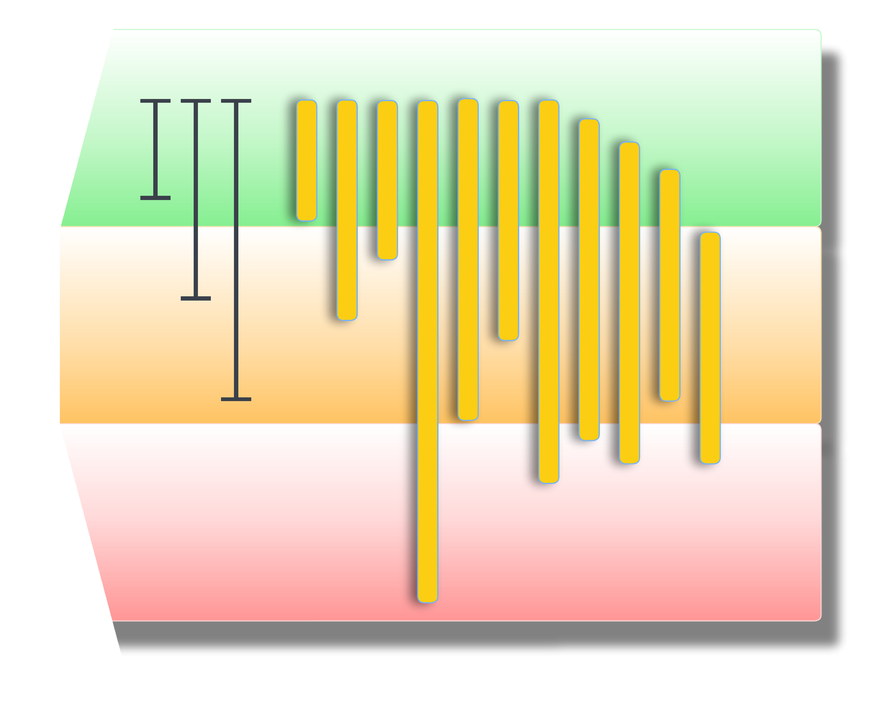
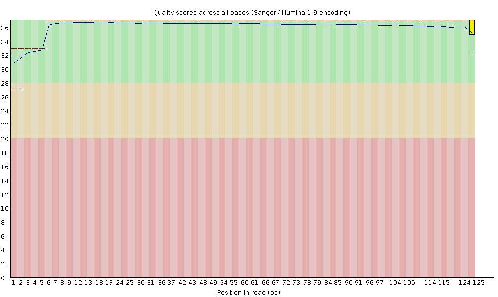
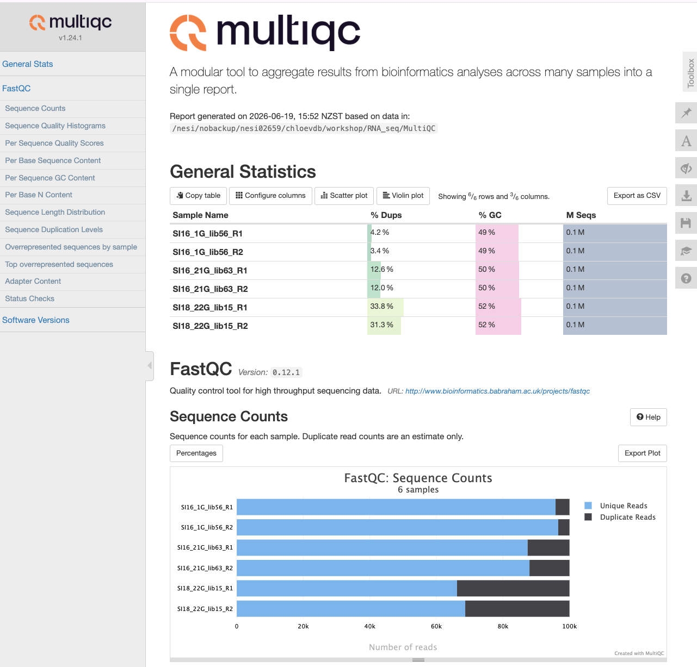
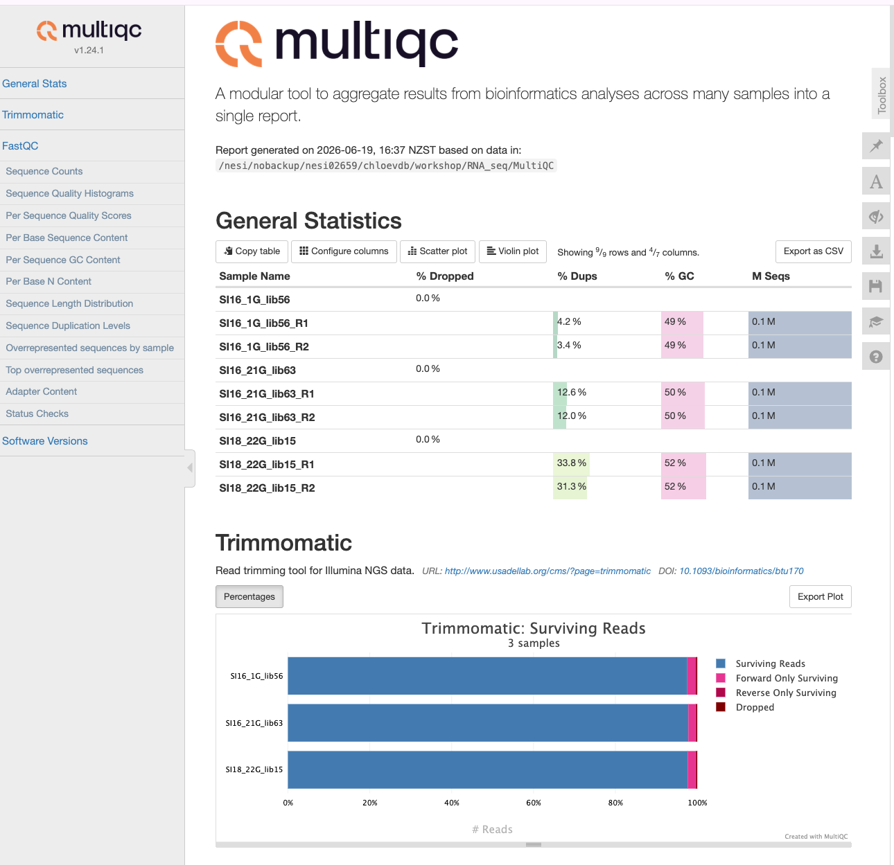

# Sequence Quality - FastQC, MultiQC and Trimmomatic
<div style="display: flex; gap: 20px;">
  
  
</div>

In this episode we will look at quality assessment of the sequencing data. We will begin with FastQC, a free program which will analyse raw sequence data and output a visual summary. Then we will introduce MultiQC, a useful tool which can be used to combine results from different software packages into a single, coherent report. Finally we will look at read cleaning. 


## Quality Assessment with FastQC

Quality assessment of high throughput sequencing data has been covered in depth and involves measurements of a number of sequence traits. FastQC, made by [Babraham Institute](https://www.bioinformatics.babraham.ac.uk/projects/fastqc/), is one of many options available for assessing the quality and is the one we will look at today. The output of FastQC is a visual representation of sequence quality which, if required, can then be used to investigate certain traits in more depth. FastQC provides a handy three colour binning system: green ticks for high quality, orange exclamation marks for middling quality that may require a manual investigation, and red crosses for low quality. 

If a sample has low quality scores in one or more aspects, this does not necessarily mean we need to remove this sample from our analysis. The next steps of the workflow involve performing some sequence cleaning and trimming which may increase the overall quality of the sequence. However, it is still worth performing QC initially and comparing this to the post-cleaning sequence. 

### Generating FastQC reports

In a terminal window navigate to your RNA-seq directory. Ensure you have a sub-directory that contains your raw sequence files (RawReads). We'll make a separate sub-directory in which to store quality control outputs and call this FastQC.

```bash
cd ~/RNA_seq 

mkdir FastQC

fastqc -o FastQC/ RawReads/*
```

The FastQC tool will generate reports on all files within the directory Raw, and output them into the QC directory. You will see an output similar to:

```
    Started analysis of SI16_1G_lib56_R1.fq.gz
    application/gzip
    Approx 5% complete for SI16_1G_lib56_R1.fq.gz
    Approx 10% complete for SI16_1G_lib56_R1.fq.gz
    Approx 15% complete for SI16_1G_lib56_R1.fq.gz
    Approx 20% complete for SI16_1G_lib56_R1.fq.gz
    Approx 25% complete for SI16_1G_lib56_R1.fq.gz
    Approx 30% complete for SI16_1G_lib56_R1.fq.gz
    Approx 35% complete for SI16_1G_lib56_R1.fq.gz
```

If we now look within the QC directory, we should see two types of files for each of our three samples. These should be called **"samplename_fastqc.html"** and **"samplename_fastqc.zip"**. There will be one report for each file, so R1 and R2 files get their own fastqc results.  

### Viewing the FastQC results

The html file outputs from FastQC can be opened in a browser for viewing. For each sample we have an overview of the quality for different metrics. On the left hand side of the report is a navigation bar that works as a broad summary. An ideal sample would have green tick marks for every measurement, while a terrible sample would have red crosses for every measurement. Most samples will have a mix and there is an element of interpretation. 



The image above shows **Per base sequence quality**, which is the first plot you can use to assess the quality of your reads. You can picture the reads as being all stacked on top of each other, and the average quality at each position (x-axis) shown as a boxplot (*i.e.,* position 1 shows a boxplot of the quality scores of base pair #1 in all reads, position 2 shows a boxplot for base pair #2, and so on).

The quality score or Q score is shown on the y-axis. A score of below Q20 (error probabilty = 0.01, or 1 in 100 bases are incorrect on average) is shown as red - boxplots that extend in to this section indicate positions in the read that are poor quality.

In general, when you are trimming your reads you should pick a quality cut off of at least Q30 (error probabilty = 0.001; 1 in 1000), and some researchers even use Q40 (error probabilty = 0.0001; 1 in 10,000) for newer data. If you are working with older data (10+ years old, sequenced before ~2014), you may need to pick Q20 as a cut-off. These plots help you decide what is best for your data.

After trimming reads, you should run FastQC again to compare how the average quality has changed and see how many reads are retained after trimming.

> 📚 Read more about Quality Scores on the [Illumina website here](https://help.basespace.illumina.com/files-used-by-basespace/quality-scores) or read more about [fastq quality encoding here.](https://en.wikipedia.org/wiki/FASTQ_format)  


##### EXERCISE 🧠🏋️‍♀️ (5 mins)

Open both (R1 and R2) of the html files for the SI16_1G sample. Most of the summary statistics pass for these files (green tick on the left). Look at the **Per base sequence content** for both reads. 

1. Why does one fail and one have a warning? Read the [FastQC documentation](https://www.bioinformatics.babraham.ac.uk/projects/fastqc/) and find the cut-offs that determine how these categories are assigned.

2. What is a likely explanation for the fail and warning for both reads? *Hint: there's a pattern you can see in both of the fastqc plots for these read files.*


::: {.callout-tip collapse="true"}
# SOLUTION

1. The fastqc documentation says warnings are issued if the difference in A/T/G/C is greater than 10% in any position and a failure if greater than 20%. The difference must be greater than 20% for the reads in the R1 file and between 10-20% for the reads in the R2 file. 

2. Biased fragmentation. Both read files show A/T/G/C bias in positions 1-12 across the reads. This is an inherent bias in almost all RNAseq data, due to random hexamer priming during library prep. Aligners such as STAR which we will use today are designed for these sorts of data and automatically account for this bias, so you do not need to do any extra processing to address this bias. 


:::

##### EXERCISE 🧠🏋️‍♀️ (5 mins)

The FastQC documentation also shows an example of Bad Illumina Data. Navigate to and [open this report.](https://www.bioinformatics.babraham.ac.uk/projects/fastqc/bad_sequence_fastqc.html)

1. Compare the **Per base sequence quality** of the bad data to our data. What do you notice that's different? 

2. The bad Illumina data gets a pass for the **Per sequence quality scores** category. Compare this plot to our data. What's the same or different, and why does the bad data get a pass for this 'per sequence' quality score category, but not the 'per base' quality score category above? *Hint: look at the fastqc documentation on this category for help.*

3. Based on the above two results, do you think it is possible to 'rescue' the bad data?

::: {.callout-tip collapse="true"}
# SOLUTION

1. The bad data shows much greater spread in quality scores across base positions. The boxplots extend well down into the low Q score range, particularly toward the 3' end of reads. In our data, quality remains consistently high across all positions, with very tight boxplots sitting in the green throughout.

2. The 'Per sequence quality scores' category allows you to see if there are a subset of reads that have universally low quality values. The bad data shows a bimodal distribution, with a smaller peak (less reads) around Q17 and a larger peak (more reads) around Q30. The documentation says a warning or fail will only be issued based on the most frequently observed mean quality, so the bad data gets a pass because the most frequently observed mean quality is ~Q30. Our data does not show the bimodal distribution pattern and virtually all reads show a mean quality of ~Q36 (definitely a pass!). 

3. Short answer: maybe. The 'Per sequence quality scores' shows there are a large number of reads with high average quality. Read trimming and filtering may retain most of these reads and discard the lower quality reads. If enough reads are retained after this, it may be possible to continue with downstream analysis (whether or not you have 'enough' reads is not trivial to determine, we will be covering this in our [Genomic Data Carpentry (Aoteroa edition)](https://genomicsaotearoa.github.io/BioinformaticsTrainingProgramme/portfolio.html#genomic-data-carpentry-nz) workshop, which is under construction). Reads that have some good bases and some bad bases (as viewed in our 'Per base sequence quality' plots) may be trimmed down, but if they become too short they will be discarded. We will see soon the effect of trimming on read length distribution.  

:::


## MultiQC - multi-sample analysis

The MultiQC application will create a report based on all documents in a given directory. MultiQC will take inputs from many different software applications, including fastQC. The report is a concise, clear document that can be used to track samples as they progress through various stages of the analysis.

To generate the MultiQC report first navigate to the RNA_seq directory and create a new output directory called MultiQC, then copy all target files to that directory (initially target files will be the FastQC documents generated above). Finally, execute the multiqc command. 

```bash
cd ~/RNA_seq/

mkdir MultiQC && cd $_

```

```bash
cp -r ../FastQC/* ./

multiqc .
```

Click on the `multiqc_report.html` file to open it (you may also need to click a 'Trust HTML' button).



After each step in the analysis (*e.g.,* read trimming, alignment) we will copy over new reports and summaries to the MultiQC directory and re-run the multiqc command. New MultiQC reports will be generated encompassing the additional information.  


## Cleaning reads with Trimmomatic

In the previous section, we took a high-level look at the quality of each of our samples using FastQC. We visualised per-base quality graphs showing the distribution of read quality at each base across all reads in a sample and extracted information about which samples fail which quality checks. Some of our samples failed a few quality metrics used by FastQC. This doesn’t mean that our samples should be thrown out! It’s very common to have some quality metrics fail, and this may or may not be a problem for your downstream application.

In this section we will perform read cleaning using Trimmomatic. Trimmomatic will trim poor quality bases in a threshold-specific manner and will filter out reads that are too short (minimum length 36bp). Trimmomatic can be used to remove primers, poly-A tails, and adapter sequences (discussed below). 


### Adapter trimming

Adapters are short, known sequences that become embedded in your reads as part of the sequencing process. Before we work with our reads we want to remove these adaptors. Because adapters are manually added to the sequencing reaction, we should know exactly what these sequences are. In our examples, we have libraries generated with the Illumina TruSeq library prep kit, which uses standard Illumina adapter sequences. 

If you do not have access to information about what adapters were used in your sequence, some software can detect certain adaptors (*e.g.,* [Trimmomatic](http://www.usadellab.org/cms/?page=trimmomatic), which has a library of Illumina adapter sequences - these will be screened against reads and if a match is detected, those adapters will be trimmed). 


We will perform adapter trimming simultaneously with quality trimming, done below. 

### Quality trimming

Quality trimming is the process of removing low-quality bases from the end of reads. Usually during sequencing it is the end (or start) of the read which has the lowest quality. By trimming only the low-quality ends of the reads, we improve our overall sequence quality without sacrificing too much data. 

Here are the parameters we will use for quality trimming with Trimmomatic:

- `trimmomatic PE` : specifies that we are working with paired-end data  

The order that trimmomatic expects input and output files in a specific order, as follows:  
  
  - `inputfile_R1` ; `inputfile_R2` : the input files for the forward and reverse reads, then: 
  - `outputfile_R1_trimmed`; `outputfile_R1_unpaired`; `outputfile_R2_trimmed`; `outputfile_R2_unpaired` : the output files for the trimmed paired and unpaired reads for the forward and reverse reads. Name these files in a way that makes it clear which are the paired and unpaired files. The trimmed paired files will be used for downstream analysis, while the unpaired files can be discarded (or used for troubleshooting).  

- `ILLUMINACLIP:TruSeq3-PE-2.fa:2:30:10`: specifies that we want to perform adapter trimming using the Illumina TruSeq3-PE-2.fa adapter file, and the parameters for this are:
  - `2` :   seedMismatches: specifies the maximum mismatch count which will still allow a full match to be performed.    
  - `30` : palindromeClipThreshold: specifies how accurate the match between the two 'adapter ligated' reads must be for PE palindrome read alignment.  
  - `10` : simpleClipThreshold: specifies how accurate the match between any adapter etc. sequence must be against a read.  
- `LEADING:5` : Remove leading (5') low quality or N bases (below quality 3)   
- `TRAILING:5` : Remove trailing (3') low quality or N bases (below quality 3)  
- `SLIDINGWINDOW:4:15` :   
- `MINLEN:36` : Drop reads below the 36 bases long (common threshold, but can adjust for your own data).    
- `2> ${name}_trimmomatic.log` :  standard output redirected to log file. Optional, but can be used as input for multiqc.

The `ADAPTERSDIR` is the path on REANNZ that contains the adapter files for Trimmomatic. You will need to adjust this path if you are using a different system. You can supply your own file containing the adapters if you wish. 


> Note: As a reminder, you should never modify your raw data (and should ideally have raw data backed up in a remote and secure location).


```bash
cd ~/RNA_seq

mkdir Trimmed && cd $_
```


```bash
ADAPTERSDIR="/opt/nesi/CS400_centos7_bdw/Trimmomatic/0.39-Java-1.8.0_144/adapters" 
FILEDIR="../RawReads"
UNPAIREDDIR="unpaired"

mkdir -p $UNPAIREDDIR

for sample in ${FILEDIR}/*_R1.fq.gz
do
name=$(basename ${sample} _R1.fq.gz) 
    trimmomatic PE \
        ${FILEDIR}/${name}_R1.fq.gz ${FILEDIR}/${name}_R2.fq.gz \
        ${name}_R1_trimmed.fq.gz  ${UNPAIREDDIR}/${name}_R1_unpaired.fq.gz \
        ${name}_R2_trimmed.fq.gz  ${UNPAIREDDIR}/${name}_R2_unpaired.fq.gz \
        ILLUMINACLIP:${ADAPTERSDIR}/TruSeq3-PE-2.fa:2:30:10 \
        LEADING:5 TRAILING:5 SLIDINGWINDOW:4:15 MINLEN:36 \
        2> ${name}_trimmomatic.log
done
```


## MultiQC update

We can now copy the log files from Trimmomatic into our MultiQC directory and re-run the multiqc command to generate an updated report which includes our read cleaning information. 

Navigate to the MultiQC directory, copy over the log files from the Trimmed directory and rerun the `multiqc` command. 

```bash
cd ../MultiQC

cp ../Trimmed/*log .

multiqc .
```

Alternatively, you can run FastQC on the trimmed files, add the FastQC results to the MultiQC dir and re-run `multiqc .`  to generate a report that has fastqc results from both the raw reads and trimmed reads. You also have the option to run multiqc on specific dirs only, rather than everything within one dir (*e.g.,* `multiqc dir1 dir2`)




We can now see the Trimmomatic metrics have been added to the new report. 


